 # 📸 Instagram — Production-Grade Low-Level Design ((Microservice Architecture))

> A **SOLID-compliant, design-pattern-driven** Low-Level Design for Instagram, built as **7 independently scalable Spring Boot microservices** + an API Gateway. Every service owns its bounded context, communicates via REST, and can be deployed/scaled independently.


---

## 📋 Table of Contents

1. [High-Level System Architecture](#1--high-level-system-architecture)
2. [Detailed Service Architecture](#2--detailed-service-architecture)
3. [Inter-Service Communication Map](#3--inter-service-communication-map)
4. [Post Upload Flow](#4--post-upload-flow-sequence-diagram)
5. [Feed Generation Algorithm](#5--feed-generation-algorithm)
6. [Engagement Flow](#6--engagement-flow-likes-comments-shares)
7. [Search Architecture](#7--search-architecture)
8. [Design Patterns & Detailed Class Diagrams](#8--design-patterns--detailed-class-diagrams)
   - [8.1 Common Module](#81--common-module--class-diagram-shared-library)
   - [8.2 User Service](#82--user-service--class-diagram-port-8081)
   - [8.3 Post Service](#83--post-service--class-diagram-port-8082)
   - [8.4 Feed Service](#84--feed-service--class-diagram-port-8083)
   - [8.5 Engagement Service](#85--engagement-service--class-diagram-port-8084)
   - [8.6 Search Service](#86--search-service--class-diagram-port-8085)
   - [8.7 Notification Service](#87--notification-service--class-diagram-port-8086)
   - [8.8 API Gateway](#88--api-gateway--class-diagram-port-8080)
9. [Database Design (ER Diagram)](#9--database-design-er-diagram)
10. [SOLID Principles](#10--solid-principles)
11. [Scaling Strategy](#11--scaling-strategy)
12. [API Reference](#12--api-reference)
13. [How to Run](#13--how-to-run)
14. [Production Upgrades Roadmap](#14--production-upgrades-roadmap)

---

## 1. 🏗️ High-Level System Architecture

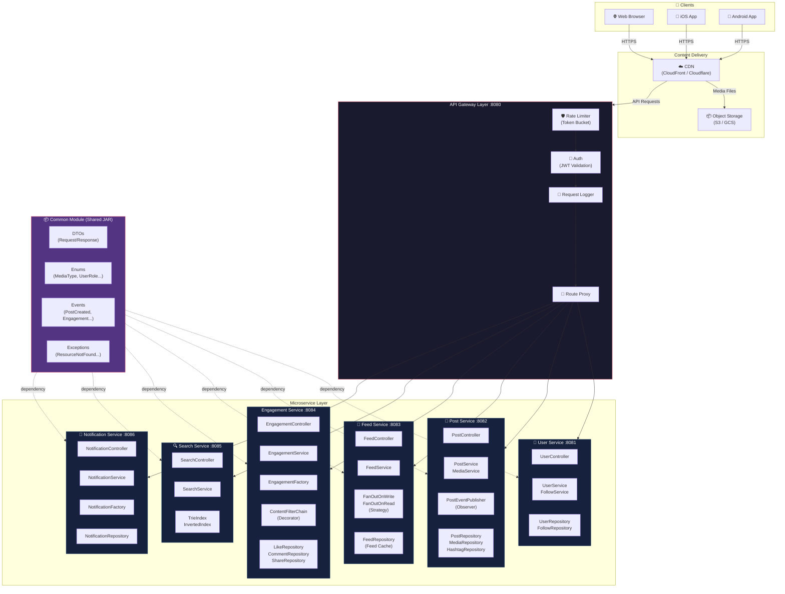
```mermaid
flowchart TB
    subgraph Clients["👥 Clients"]
        WEB["🌐 Web Browser"]
        IOS["📱 iOS App"]
        AND["📱 Android App"]
    end

    subgraph CDN_LAYER["Content Delivery"]
        CDN["☁️ CDN<br/>(CloudFront / Cloudflare)"]
        S3["📦 Object Storage<br/>(S3 / GCS)"]
    end

    subgraph GATEWAY["API Gateway Layer :8080"]
        direction LR
        RL["🛡️ Rate Limiter<br/>(Token Bucket)"]
        AUTH["🔐 Auth<br/>(JWT Validation)"]
        LOG["📝 Request Logger"]
        ROUTE["🔀 Route Proxy"]
    end

    subgraph SERVICES["Microservice Layer"]
        direction TB

        subgraph USER_SVC["👤 User Service :8081"]
            US_C["UserController"]
            US_S["UserService<br/>FollowService"]
            US_R["UserRepository<br/>FollowRepository"]
        end

        subgraph POST_SVC["📝 Post Service :8082"]
            PS_C["PostController"]
            PS_S["PostService<br/>MediaService"]
            PS_O["PostEventPublisher<br/>(Observer)"]
            PS_R["PostRepository<br/>MediaRepository<br/>HashtagRepository"]
        end

        subgraph FEED_SVC["📰 Feed Service :8083"]
            FS_C["FeedController"]
            FS_S["FeedService"]
            FS_ST["FanOutOnWrite<br/>FanOutOnRead<br/>(Strategy)"]
            FS_R["FeedRepository<br/>(Feed Cache)"]
        end

        subgraph ENGAGE_SVC["Engagement Service :8084"]
            ES_C["EngagementController"]
            ES_S["EngagementService"]
            ES_F["EngagementFactory"]
            ES_D["ContentFilterChain<br/>(Decorator)"]
            ES_R["LikeRepository<br/>CommentRepository<br/>ShareRepository"]
        end

        subgraph SEARCH_SVC["🔍 Search Service :8085"]
            SS_C["SearchController"]
            SS_S["SearchService"]
            SS_I["TrieIndex<br/>InvertedIndex"]
        end

        subgraph NOTIFY_SVC["🔔 Notification Service :8086"]
            NS_C["NotificationController"]
            NS_S["NotificationService"]
            NS_F["NotificationFactory"]
            NS_R["NotificationRepository"]
        end
    end

    subgraph COMMON["📦 Common Module (Shared JAR)"]
        DTO["DTOs<br/>(Request/Response)"]
        ENUM["Enums<br/>(MediaType, UserRole...)"]
        EVENT["Events<br/>(PostCreated, Engagement...)"]
        EXC["Exceptions<br/>(ResourceNotFound...)"]
    end

    WEB & IOS & AND -->|"HTTPS"| CDN
    CDN -->|"API Requests"| GATEWAY
    CDN -->|"Media Files"| S3

    RL --> AUTH --> LOG --> ROUTE
    ROUTE --> USER_SVC & POST_SVC & FEED_SVC & ENGAGE_SVC & SEARCH_SVC & NOTIFY_SVC

    COMMON -.->|"dependency"| USER_SVC & POST_SVC & FEED_SVC & ENGAGE_SVC & SEARCH_SVC & NOTIFY_SVC

    style GATEWAY fill:#1a1a2e,stroke:#e94560,color:#fff
    style USER_SVC fill:#16213e,stroke:#0f3460,color:#fff
    style POST_SVC fill:#16213e,stroke:#0f3460,color:#fff
    style FEED_SVC fill:#16213e,stroke:#0f3460,color:#fff
    style ENGAGE_SVC fill:#16213e,stroke:#0f3460,color:#fff
    style SEARCH_SVC fill:#16213e,stroke:#0f3460,color:#fff
    style NOTIFY_SVC fill:#16213e,stroke:#0f3460,color:#fff
    style COMMON fill:#533483,stroke:#e94560,color:#fff
```

---

## 2. 🔍 Detailed Service Architecture

### Per-Service Internal Architecture

Each microservice follows a **clean layered architecture** with strict dependency flow:

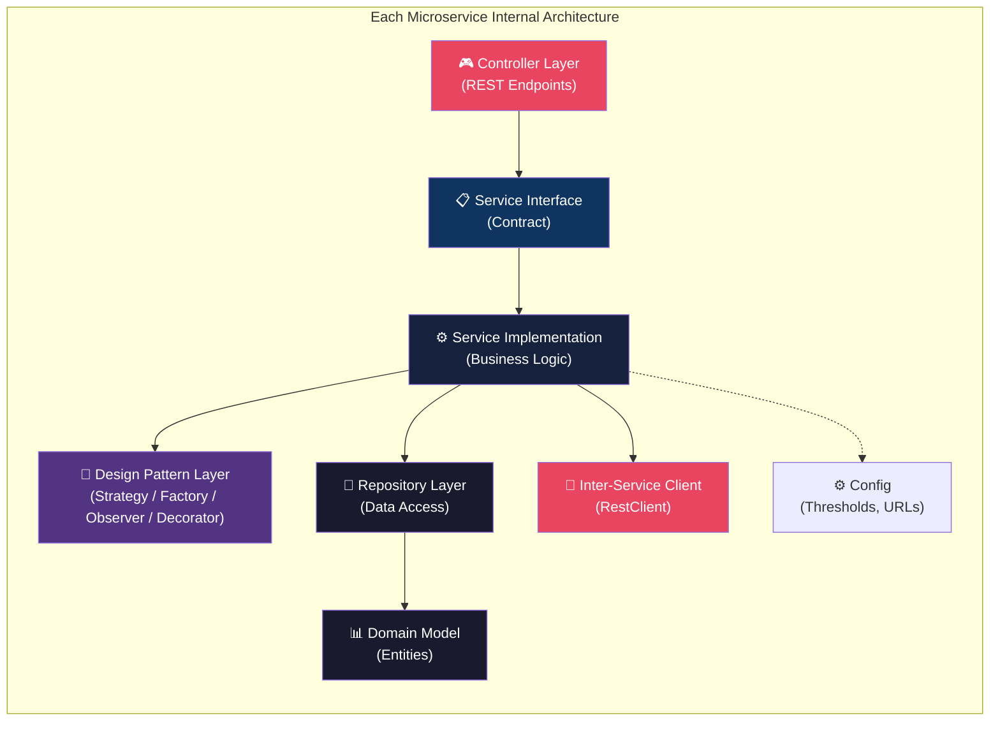
```mermaid
flowchart TD
    subgraph EACH_SERVICE["Each Microservice Internal Architecture"]
        direction TB
        CTRL["🎮 Controller Layer<br/>(REST Endpoints)"]
        SVC_I["📋 Service Interface<br/>(Contract)"]
        SVC_IMPL["⚙️ Service Implementation<br/>(Business Logic)"]
        PATTERN["🎨 Design Pattern Layer<br/>(Strategy / Factory / Observer / Decorator)"]
        REPO["💾 Repository Layer<br/>(Data Access)"]
        MODEL["📊 Domain Model<br/>(Entities)"]
        CLIENT["🔗 Inter-Service Client<br/>(RestClient)"]
        CONFIG["⚙️ Config<br/>(Thresholds, URLs)"]

        CTRL --> SVC_I
        SVC_I --> SVC_IMPL
        SVC_IMPL --> PATTERN
        SVC_IMPL --> REPO
        SVC_IMPL --> CLIENT
        REPO --> MODEL
        SVC_IMPL -.-> CONFIG
    end

    style CTRL fill:#e94560,color:#fff
    style SVC_I fill:#0f3460,color:#fff
    style SVC_IMPL fill:#16213e,color:#fff
    style PATTERN fill:#533483,color:#fff
    style REPO fill:#1a1a2e,color:#fff
    style MODEL fill:#1a1a2e,color:#fff
    style CLIENT fill:#e94560,color:#fff
```

### Module Breakdown

```
instagram/                                    # Parent POM (module aggregator)
├── pom.xml
├── README.md
│
├── common/                                   # 14 files — Shared JAR (NO Spring Boot)
│   └── com.instagram.common/
│       ├── dto/request/                      # CreatePostRequest, CreateCommentRequest, etc.
│       ├── dto/response/                     # PostResponse, FeedResponse, etc.
│       ├── enums/                            # MediaType, PostStatus, UserRole, etc.
│       ├── event/                            # PostCreatedEvent, EngagementEvent, etc.
│       └── exception/                        # ResourceNotFoundException, etc.
│
├── api-gateway/         :8080                # 4 files — Facade + Rate Limiting
├── user-service/        :8081                # 8 files — Users + Social Graph
├── post-service/        :8082                # 12 files — Posts + Media + Observer
├── feed-service/        :8083                # 9 files — Feed + Strategy Pattern
├── engagement-service/  :8084                # 11 files — Factory + Decorator
├── search-service/      :8085                # 6 files — Trie + Inverted Index
└── notification-service/:8086                # 7 files — Factory + Event-Driven
```

---

## 3. 🔗 Inter-Service Communication Map

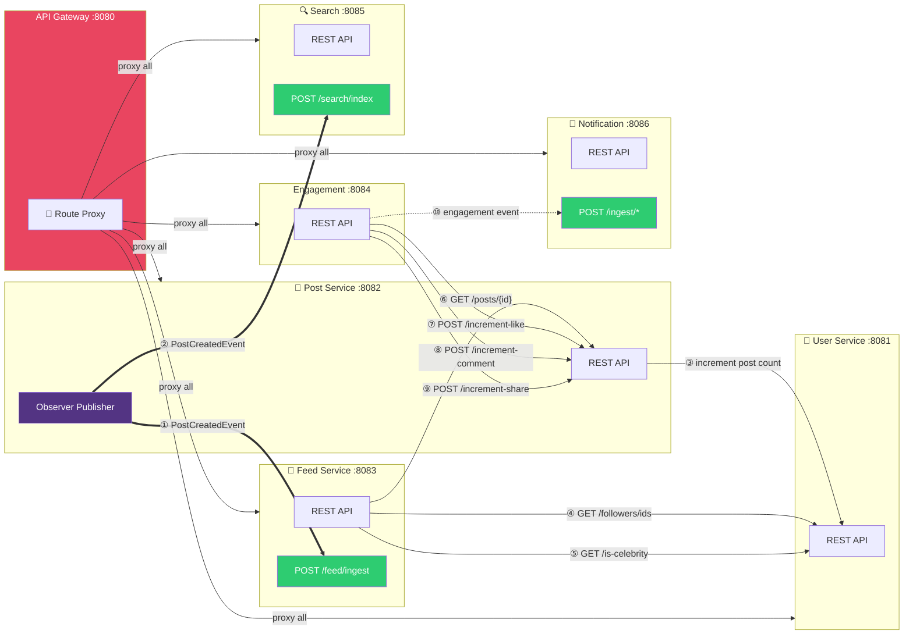
```mermaid
flowchart LR
    subgraph GATEWAY["API Gateway :8080"]
        GW["🔀 Route Proxy"]
    end

    subgraph US["👤 User Service :8081"]
        US_API["REST API"]
    end

    subgraph PS["📝 Post Service :8082"]
        PS_API["REST API"]
        PS_OBS["Observer Publisher"]
    end

    subgraph FS["📰 Feed Service :8083"]
        FS_API["REST API"]
        FS_INGEST["POST /feed/ingest"]
    end

    subgraph ES[" Engagement :8084"]
        ES_API["REST API"]
    end

    subgraph SS["🔍 Search :8085"]
        SS_API["REST API"]
        SS_INDEX["POST /search/index"]
    end

    subgraph NS["🔔 Notification :8086"]
        NS_API["REST API"]
        NS_INGEST["POST /ingest/*"]
    end

    GW -->|"proxy all"| US & PS & FS & ES & SS & NS

    PS_OBS ==>|"① PostCreatedEvent"| FS_INGEST
    PS_OBS ==>|"② PostCreatedEvent"| SS_INDEX
    PS_API -->|"③ increment post count"| US_API

    FS_API -->|"④ GET /followers/ids"| US_API
    FS_API -->|"⑤ GET /is-celebrity"| US_API
    FS_API -->|"⑥ GET /posts/{id}"| PS_API

    ES_API -->|"⑦ POST /increment-like"| PS_API
    ES_API -->|"⑧ POST /increment-comment"| PS_API
    ES_API -->|"⑨ POST /increment-share"| PS_API
    ES_API -.->|"⑩ engagement event"| NS_INGEST

    style GATEWAY fill:#e94560,color:#fff
    style PS_OBS fill:#533483,color:#fff
    style FS_INGEST fill:#2ecc71,color:#fff
    style SS_INDEX fill:#2ecc71,color:#fff
    style NS_INGEST fill:#2ecc71,color:#fff
```

### Communication Details

| # | From | To | Method | Endpoint | Purpose |
|---|------|----|--------|----------|---------|
| ① | Post Service | Feed Service | `POST` | `/api/v1/feed/ingest` | Trigger feed fan-out for new post |
| ② | Post Service | Search Service | `POST` | `/api/v1/search/index` | Index post content for search |
| ③ | Post Service | User Service | `POST` | `/api/v1/users/{id}/increment-post-count` | Update author's post count |
| ④ | Feed Service | User Service | `GET` | `/api/v1/users/{id}/followers/ids` | Get follower IDs for fan-out |
| ⑤ | Feed Service | User Service | `GET` | `/api/v1/users/{id}/is-celebrity` | Check if push or pull strategy |
| ⑥ | Feed Service | Post Service | `GET` | `/api/v1/posts/{id}` | Fetch post details for feed rendering |
| ⑦⑧⑨ | Engagement | Post Service | `POST` | `/api/v1/posts/{id}/increment-*` | Update engagement counters |
| ⑩ | Engagement | Notification | `POST` | `/api/v1/notifications/ingest/*` | Trigger like/comment notifications |

---

## 4. 📤 Post Upload Flow (Sequence Diagram)

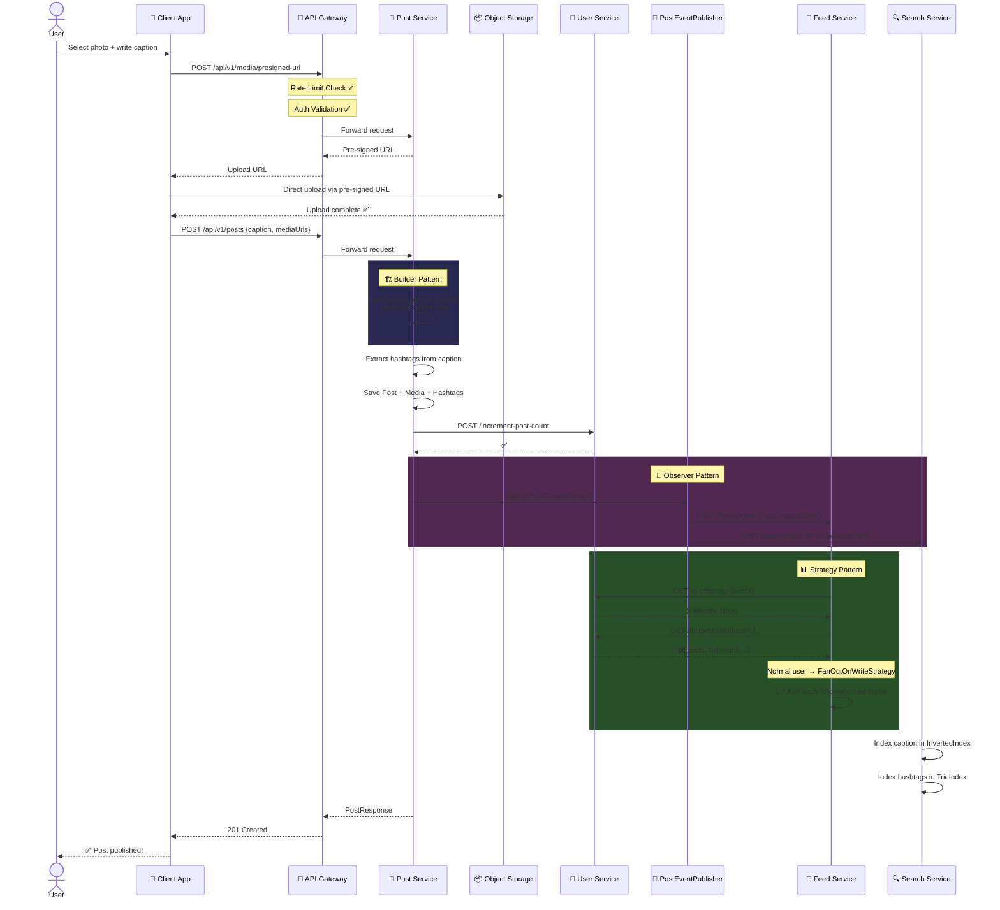
```mermaid
sequenceDiagram
    actor User
    participant Client as 📱 Client App
    participant GW as 🔀 API Gateway
    participant PS as 📝 Post Service
    participant S3 as 📦 Object Storage
    participant US as 👤 User Service
    participant PEP as 📢 PostEventPublisher
    participant FS as 📰 Feed Service
    participant SS as 🔍 Search Service

    User->>Client: Select photo + write caption
    Client->>GW: POST /api/v1/media/presigned-url

    Note over GW: Rate Limit Check ✅
    Note over GW: Auth Validation ✅

    GW->>PS: Forward request
    PS-->>GW: Pre-signed URL
    GW-->>Client: Upload URL

    Client->>S3: Direct upload via pre-signed URL
    S3-->>Client: Upload complete ✅

    Client->>GW: POST /api/v1/posts {caption, mediaUrls}
    GW->>PS: Forward request

    rect rgb(40, 40, 80)
        Note over PS: 🏗️ Builder Pattern
        PS->>PS: new Post.Builder(id, userId)<br/>.caption("Golden hour #travel")<br/>.addMedia(photo)<br/>.hashtags(["travel"])<br/>.build()
    end

    PS->>PS: Extract hashtags from caption
    PS->>PS: Save Post + Media + Hashtags

    PS->>US: POST /increment-post-count
    US-->>PS: ✅

    rect rgb(80, 40, 80)
        Note over PEP: 👀 Observer Pattern
        PS->>PEP: publishPostCreated(event)
        PEP->>FS: POST /feed/ingest (PostCreatedEvent)
        PEP->>SS: POST /search/index (PostCreatedEvent)
    end

    rect rgb(40, 80, 40)
        Note over FS: 📊 Strategy Pattern
        FS->>US: GET /is-celebrity/{userId}
        US-->>FS: {celebrity: false}
        FS->>US: GET /followers/ids/{userId}
        US-->>FS: [follower1, follower2, ...]
        Note over FS: Normal user → FanOutOnWriteStrategy
        FS->>FS: LPUSH each follower's feed cache
    end

    SS->>SS: Index caption in InvertedIndex
    SS->>SS: Index hashtags in TrieIndex

    PS-->>GW: PostResponse
    GW-->>Client: 201 Created
    Client-->>User: ✅ Post published!
```

---

## 5. 📰 Feed Generation Algorithm

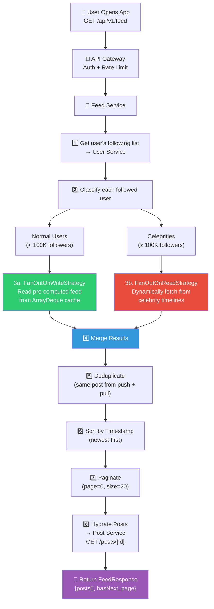
```mermaid
flowchart TD
    START["📱 User Opens App<br/>GET /api/v1/feed"]

    START --> AUTH["🔐 API Gateway<br/>Auth + Rate Limit"]
    AUTH --> FS["📰 Feed Service"]

    FS --> GET_FOLLOWING["1️⃣ Get user's following list<br/>→ User Service"]
    GET_FOLLOWING --> CLASSIFY["2️⃣ Classify each followed user"]

    CLASSIFY --> NORMAL["Normal Users<br/>(< 100K followers)"]
    CLASSIFY --> CELEB["Celebrities<br/>(≥ 100K followers)"]

    NORMAL --> PUSH["3a. FanOutOnWriteStrategy<br/>Read pre-computed feed<br/>from ArrayDeque cache"]
    CELEB --> PULL["3b. FanOutOnReadStrategy<br/>Dynamically fetch from<br/>celebrity timelines"]

    PUSH --> MERGE["4️⃣ Merge Results"]
    PULL --> MERGE

    MERGE --> DEDUP["5️⃣ Deduplicate<br/>(same post from push + pull)"]
    DEDUP --> SORT["6️⃣ Sort by Timestamp<br/>(newest first)"]
    SORT --> PAGINATE["7️⃣ Paginate<br/>(page=0, size=20)"]
    PAGINATE --> HYDRATE["8️⃣ Hydrate Posts<br/>→ Post Service<br/>GET /posts/{id}"]
    HYDRATE --> RESPONSE["📱 Return FeedResponse<br/>{posts[], hasNext, page}"]

    style PUSH fill:#2ecc71,color:#fff
    style PULL fill:#e74c3c,color:#fff
    style MERGE fill:#3498db,color:#fff
    style RESPONSE fill:#9b59b6,color:#fff
```

### Strategy Comparison

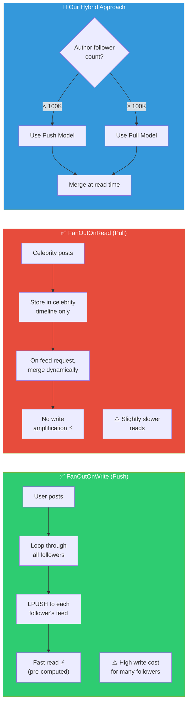
```mermaid
flowchart LR
    subgraph WRITE["✅ FanOutOnWrite (Push)"]
        direction TB
        W1["User posts"] --> W2["Loop through<br/>all followers"]
        W2 --> W3["LPUSH to each<br/>follower's feed"]
        W3 --> W4["Fast read ⚡<br/>(pre-computed)"]
        W5["⚠️ High write cost<br/>for many followers"]
    end

    subgraph READ["✅ FanOutOnRead (Pull)"]
        direction TB
        R1["Celebrity posts"] --> R2["Store in celebrity<br/>timeline only"]
        R2 --> R3["On feed request,<br/>merge dynamically"]
        R3 --> R4["No write<br/>amplification ⚡"]
        R5["⚠️ Slightly slower<br/>reads"]
    end

    subgraph HYBRID["🎯 Our Hybrid Approach"]
        direction TB
        H1{"Author follower<br/>count?"}
        H1 -->|"< 100K"| H2["Use Push Model"]
        H1 -->|"≥ 100K"| H3["Use Pull Model"]
        H2 & H3 --> H4["Merge at read time"]
    end

    style WRITE fill:#2ecc71,color:#fff
    style READ fill:#e74c3c,color:#fff
    style HYBRID fill:#3498db,color:#fff
```

### Feed Data Flow Example

```
User John (ID: 123) follows:
├── alice (500 followers)    → Push model: post pre-loaded in John's feed
├── bob (200 followers)      → Push model: post pre-loaded in John's feed
└── taylor_swift (50M followers) → Pull model: fetched dynamically at read time

When John opens his feed:
1. Read pre-computed feed: [alice_post_1, bob_post_3, alice_post_2, ...]
2. Fetch celebrity timeline: [taylor_swift_post_1, taylor_swift_post_2, ...]
3. Merge + sort by time → Final feed
```

---

## 6. Engagement Flow (Likes, Comments, Shares)

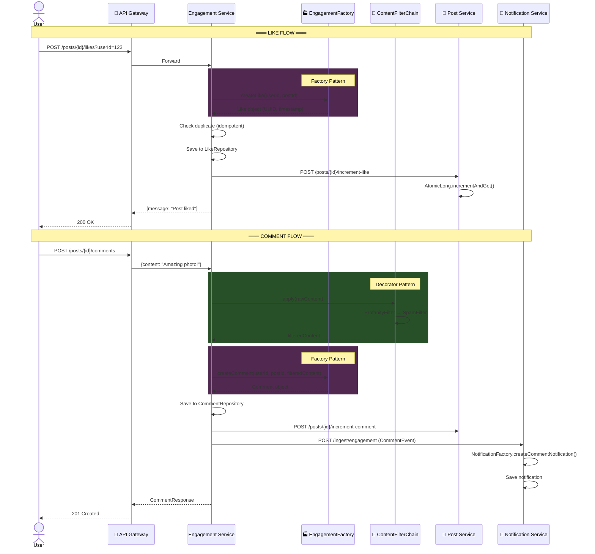
```mermaid
sequenceDiagram
    actor User
    participant GW as 🔀 API Gateway
    participant ES as  Engagement Service
    participant EF as 🏭 EngagementFactory
    participant CFC as 🧹 ContentFilterChain
    participant PS as 📝 Post Service
    participant NS as 🔔 Notification Service

    Note over User,NS: ═══ LIKE FLOW ═══

    User->>GW: POST /posts/{id}/likes?userId=123
    GW->>ES: Forward

    rect rgb(80, 40, 80)
        Note over EF: Factory Pattern
        ES->>EF: createLike(userId, postId)
        EF-->>ES: Like object (UUID, timestamp)
    end

    ES->>ES: Check duplicate (idempotent)
    ES->>ES: Save to LikeRepository
    ES->>PS: POST /posts/{id}/increment-like
    PS->>PS: AtomicLong.incrementAndGet()
    ES-->>GW: {message: "Post liked"}
    GW-->>User: 200 OK

    Note over User,NS: ═══ COMMENT FLOW ═══

    User->>GW: POST /posts/{id}/comments
    GW->>ES: {content: "Amazing photo!"}

    rect rgb(40, 80, 40)
        Note over CFC: Decorator Pattern
        ES->>CFC: apply(rawContent)
        CFC->>CFC: ProfanityFilter → SpamFilter
        CFC-->>ES: filteredContent
    end

    rect rgb(80, 40, 80)
        Note over EF: Factory Pattern
        ES->>EF: createComment(userId, postId, filteredContent)
        EF-->>ES: Comment object
    end

    ES->>ES: Save to CommentRepository
    ES->>PS: POST /posts/{id}/increment-comment
    ES->>NS: POST /ingest/engagement (CommentEvent)
    NS->>NS: NotificationFactory.createCommentNotification()
    NS->>NS: Save notification
    ES-->>GW: CommentResponse
    GW-->>User: 201 Created
```

### Content Filter Decorator Chain

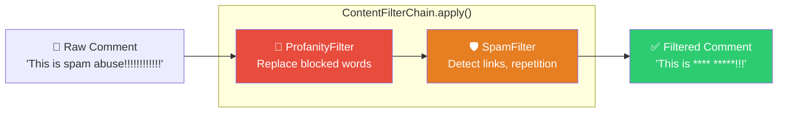
```mermaid
flowchart LR
    INPUT["📝 Raw Comment<br/>'This is spam abuse!!!!!!!!!!!!'"]
    PF["🚫 ProfanityFilter<br/>Replace blocked words"]
    SF["🛡️ SpamFilter<br/>Detect links, repetition"]
    OUTPUT["✅ Filtered Comment<br/>'This is **** *****!!!'"]

    INPUT --> PF --> SF --> OUTPUT

    subgraph CHAIN["ContentFilterChain.apply()"]
        PF
        SF
    end

    style PF fill:#e74c3c,color:#fff
    style SF fill:#e67e22,color:#fff
    style OUTPUT fill:#2ecc71,color:#fff
```

---

## 7. 🔍 Search Architecture

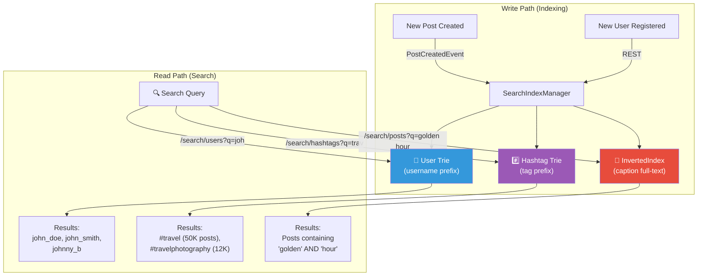
```mermaid
flowchart TB
    subgraph INDEXING["Write Path (Indexing)"]
        direction TB
        NEW_POST["New Post Created"]
        NEW_USER["New User Registered"]

        NEW_POST -->|"PostCreatedEvent"| SIM["SearchIndexManager"]
        NEW_USER -->|"REST"| SIM

        SIM --> TRIE_U["👤 User Trie<br/>(username prefix)"]
        SIM --> TRIE_H["#️⃣ Hashtag Trie<br/>(tag prefix)"]
        SIM --> INV["📄 InvertedIndex<br/>(caption full-text)"]
    end

    subgraph SEARCH_PATH["Read Path (Search)"]
        direction TB
        QUERY["🔍 Search Query"]

        QUERY -->|"/search/users?q=joh"| TRIE_U
        QUERY -->|"/search/hashtags?q=trav"| TRIE_H
        QUERY -->|"/search/posts?q=golden hour"| INV

        TRIE_U --> RES_U["Results:<br/>john_doe, john_smith,<br/>johnny_b"]
        TRIE_H --> RES_H["Results:<br/>#travel (50K posts),<br/>#travelphotography (12K)"]
        INV --> RES_P["Results:<br/>Posts containing<br/>'golden' AND 'hour'"]
    end

    style TRIE_U fill:#3498db,color:#fff
    style TRIE_H fill:#9b59b6,color:#fff
    style INV fill:#e74c3c,color:#fff
```

### Trie Data Structure (Autocomplete)

```
Root
├── j
│   └── o
│       └── h
│           └── n
│               ├── _doe     → {id: "u1", score: 9.5}
│               ├── _smith   → {id: "u2", score: 7.2}
│               └── ny_b     → {id: "u3", score: 4.1}
├── s
│   └── a
│       └── r
│           └── a
│               └── h        → {id: "u4", score: 8.8}
└── t
    └── r
        └── a
            └── v
                └── e
                    └── l     → {tag: "travel", posts: 50K}
```

---

## 8. 🎨 Design Patterns & Detailed Class Diagrams

### All 7 Patterns — Where & Why

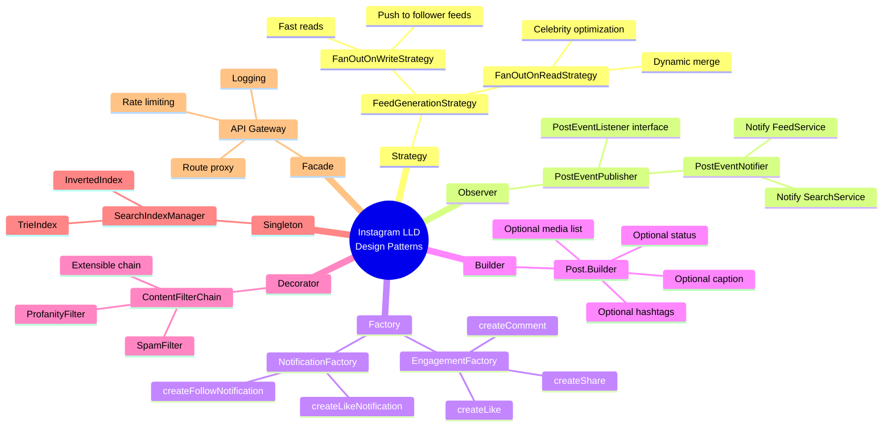
```mermaid
mindmap
    root((Instagram LLD<br/>Design Patterns))
        Strategy
            FeedGenerationStrategy
                FanOutOnWriteStrategy
                    Push to follower feeds
                    Fast reads
                FanOutOnReadStrategy
                    Celebrity optimization
                    Dynamic merge
        Observer
            PostEventPublisher
                PostEventListener interface
                PostEventNotifier
                    Notify FeedService
                    Notify SearchService
        Factory
            EngagementFactory
                createLike
                createComment
                createShare
            NotificationFactory
                createLikeNotification
                createFollowNotification
        Builder
            Post.Builder
                Optional caption
                Optional media list
                Optional hashtags
                Optional status
        Decorator
            ContentFilterChain
                ProfanityFilter
                SpamFilter
                Extensible chain
        Singleton
            SearchIndexManager
                TrieIndex
                InvertedIndex
        Facade
            API Gateway
                Route proxy
                Rate limiting
                Logging
```

---

### 8.1 📦 Common Module — Class Diagram (Shared Library)

> Shared JAR dependency used by all 7 microservices. Contains DTOs, enums, events, and exceptions. **No Spring Boot — pure Java.**


```mermaid
classDiagram
    direction TB

    namespace Enums {
        class MediaType {
            <<enumeration>>
            PHOTO
            VIDEO
            CAROUSEL
        }

        class PostStatus {
            <<enumeration>>
            DRAFT
            PUBLISHED
            ARCHIVED
            DELETED
        }

        class UserRole {
            <<enumeration>>
            NORMAL
            CELEBRITY
            VERIFIED
            BUSINESS
        }

        class EngagementType {
            <<enumeration>>
            LIKE
            COMMENT
            SHARE
        }

        class NotificationType {
            <<enumeration>>
            LIKE
            COMMENT
            FOLLOW
            MENTION
        }
    }

    namespace RequestDTOs {
        class CreateUserRequest {
            -String username
            -String email
            -String fullName
            -String bio
            +getUsername() String
            +getEmail() String
            +getFullName() String
            +getBio() String
        }

        class CreatePostRequest {
            -String userId
            -String caption
            -List~MediaItem~ mediaItems
            +getUserId() String
            +getCaption() String
            +getMediaItems() List
        }

        class CreatePostRequest_MediaItem {
            -String url
            -MediaType mediaType
            -int width
            -int height
            +getUrl() String
            +getMediaType() MediaType
        }

        class CreateCommentRequest {
            -String userId
            -String postId
            -String content
            -String parentCommentId
            +getUserId() String
            +getContent() String
        }
    }

    namespace ResponseDTOs {
        class UserProfileResponse {
            -String userId
            -String username
            -String email
            -String fullName
            -String bio
            -String profilePictureUrl
            -long followerCount
            -long followingCount
            -long postCount
            -Instant createdAt
        }

        class PostResponse {
            -String postId
            -String userId
            -String caption
            -List~String~ hashtags
            -PostStatus status
            -List~MediaItem~ media
            -long likeCount
            -long commentCount
            -long shareCount
            -Instant createdAt
        }

        class FeedResponse {
            -String userId
            -List~PostResponse~ posts
            -int page
            -int size
            -boolean hasNext
        }

        class CommentResponse {
            -String commentId
            -String postId
            -String userId
            -String content
            -String parentCommentId
            -Instant createdAt
        }

        class SearchResponse {
            -String query
            -String type
            -List~UserProfileResponse~ users
            -List~HashtagResult~ hashtags
            -int totalResults
        }
    }

    namespace Events {
        class PostCreatedEvent {
            -String postId
            -String userId
            -String caption
            -long authorFollowerCount
            -Instant timestamp
        }

        class PostDeletedEvent {
            -String postId
            -String userId
        }

        class EngagementEvent {
            -String userId
            -String postId
            -String postOwnerId
            -EngagementType type
            -String content
        }

        class UserFollowedEvent {
            -String followerId
            -String followeeId
        }
    }

    namespace Exceptions {
        class ResourceNotFoundException {
            -String resourceType
            -String resourceId
            +ResourceNotFoundException(type, id)
        }

        class DuplicateResourceException {
            -String resourceType
            -String identifier
        }

        class UnauthorizedException {
            -String message
        }
    }

    CreatePostRequest --> CreatePostRequest_MediaItem
    CreatePostRequest_MediaItem --> MediaType
    PostResponse --> PostStatus
    EngagementEvent --> EngagementType
```

---

### 8.2 👤 User Service — Class Diagram (Port 8081)

> Manages user registration, profiles, social graph (follow/unfollow), and celebrity detection. **Pattern: Interface Segregation (ISP)** — `UserService` and `FollowService` are separate interfaces.

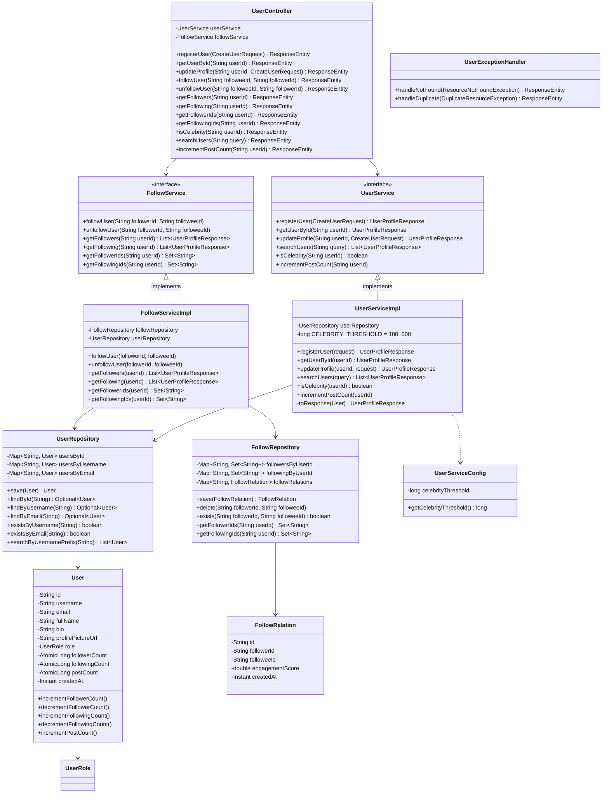
```mermaid
classDiagram
    direction TB

    class UserController {
        -UserService userService
        -FollowService followService
        +registerUser(CreateUserRequest) ResponseEntity
        +getUserById(String userId) ResponseEntity
        +updateProfile(String userId, CreateUserRequest) ResponseEntity
        +followUser(String followeeId, String followerId) ResponseEntity
        +unfollowUser(String followeeId, String followerId) ResponseEntity
        +getFollowers(String userId) ResponseEntity
        +getFollowing(String userId) ResponseEntity
        +getFollowerIds(String userId) ResponseEntity
        +getFollowingIds(String userId) ResponseEntity
        +isCelebrity(String userId) ResponseEntity
        +searchUsers(String query) ResponseEntity
        +incrementPostCount(String userId) ResponseEntity
    }

    class UserService {
        <<interface>>
        +registerUser(CreateUserRequest) UserProfileResponse
        +getUserById(String userId) UserProfileResponse
        +updateProfile(String userId, CreateUserRequest) UserProfileResponse
        +searchUsers(String query) List~UserProfileResponse~
        +isCelebrity(String userId) boolean
        +incrementPostCount(String userId)
    }

    class FollowService {
        <<interface>>
        +followUser(String followerId, String followeeId)
        +unfollowUser(String followerId, String followeeId)
        +getFollowers(String userId) List~UserProfileResponse~
        +getFollowing(String userId) List~UserProfileResponse~
        +getFollowerIds(String userId) Set~String~
        +getFollowingIds(String userId) Set~String~
    }

    class UserServiceImpl {
        -UserRepository userRepository
        -long CELEBRITY_THRESHOLD = 100_000
        +registerUser(request) UserProfileResponse
        +getUserById(userId) UserProfileResponse
        +updateProfile(userId, request) UserProfileResponse
        +searchUsers(query) List~UserProfileResponse~
        +isCelebrity(userId) boolean
        +incrementPostCount(userId)
        -toResponse(User) UserProfileResponse
    }

    class FollowServiceImpl {
        -FollowRepository followRepository
        -UserRepository userRepository
        +followUser(followerId, followeeId)
        +unfollowUser(followerId, followeeId)
        +getFollowers(userId) List~UserProfileResponse~
        +getFollowing(userId) List~UserProfileResponse~
        +getFollowerIds(userId) Set~String~
        +getFollowingIds(userId) Set~String~
    }

    class User {
        -String id
        -String username
        -String email
        -String fullName
        -String bio
        -String profilePictureUrl
        -UserRole role
        -AtomicLong followerCount
        -AtomicLong followingCount
        -AtomicLong postCount
        -Instant createdAt
        +incrementFollowerCount()
        +decrementFollowerCount()
        +incrementFollowingCount()
        +decrementFollowingCount()
        +incrementPostCount()
    }

    class FollowRelation {
        -String id
        -String followerId
        -String followeeId
        -double engagementScore
        -Instant createdAt
    }

    class UserRepository {
        -Map~String, User~ usersById
        -Map~String, User~ usersByUsername
        -Map~String, User~ usersByEmail
        +save(User) User
        +findById(String) Optional~User~
        +findByUsername(String) Optional~User~
        +findByEmail(String) Optional~User~
        +existsByUsername(String) boolean
        +existsByEmail(String) boolean
        +searchByUsernamePrefix(String) List~User~
    }

    class FollowRepository {
        -Map~String, Set~String~~ followersByUserId
        -Map~String, Set~String~~ followingByUserId
        -Map~String, FollowRelation~ followRelations
        +save(FollowRelation) FollowRelation
        +delete(String followerId, String followeeId)
        +exists(String followerId, String followeeId) boolean
        +getFollowerIds(String userId) Set~String~
        +getFollowingIds(String userId) Set~String~
    }

    class UserServiceConfig {
        -long celebrityThreshold
        +getCelebrityThreshold() long
    }

    class UserExceptionHandler {
        +handleNotFound(ResourceNotFoundException) ResponseEntity
        +handleDuplicate(DuplicateResourceException) ResponseEntity
    }

    UserController --> UserService
    UserController --> FollowService
    UserService <|.. UserServiceImpl : implements
    FollowService <|.. FollowServiceImpl : implements
    UserServiceImpl --> UserRepository
    FollowServiceImpl --> FollowRepository
    FollowServiceImpl --> UserRepository
    UserRepository --> User
    FollowRepository --> FollowRelation
    User --> UserRole
    UserServiceImpl ..> UserServiceConfig
```

---

### 8.3 📝 Post Service — Class Diagram (Port 8082)

> Manages post creation, media metadata, and hashtag extraction. **Patterns: Builder (Post), Observer (PostEventPublisher/Listener)**

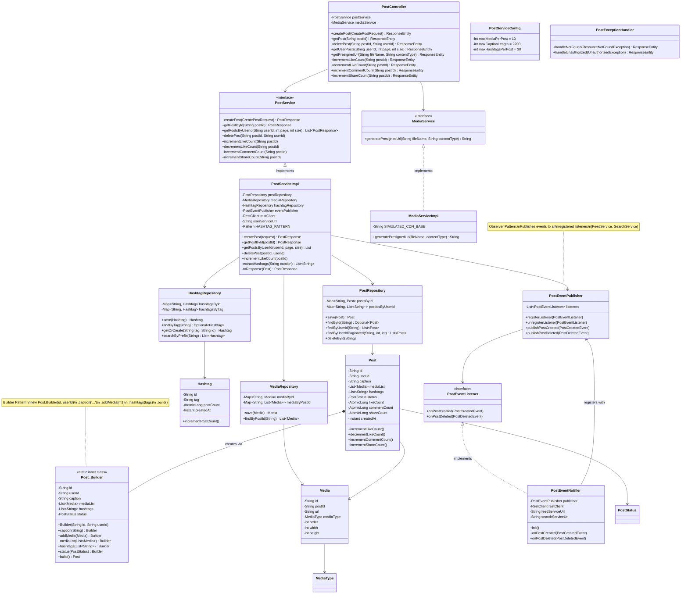
```mermaid
classDiagram
    direction TB

    class PostController {
        -PostService postService
        -MediaService mediaService
        +createPost(CreatePostRequest) ResponseEntity
        +getPost(String postId) ResponseEntity
        +deletePost(String postId, String userId) ResponseEntity
        +getUserPosts(String userId, int page, int size) ResponseEntity
        +getPresignedUrl(String fileName, String contentType) ResponseEntity
        +incrementLikeCount(String postId) ResponseEntity
        +decrementLikeCount(String postId) ResponseEntity
        +incrementCommentCount(String postId) ResponseEntity
        +incrementShareCount(String postId) ResponseEntity
    }

    class PostService {
        <<interface>>
        +createPost(CreatePostRequest) PostResponse
        +getPostById(String postId) PostResponse
        +getPostsByUserId(String userId, int page, int size) List~PostResponse~
        +deletePost(String postId, String userId)
        +incrementLikeCount(String postId)
        +decrementLikeCount(String postId)
        +incrementCommentCount(String postId)
        +incrementShareCount(String postId)
    }

    class MediaService {
        <<interface>>
        +generatePresignedUrl(String fileName, String contentType) String
    }

    class PostServiceImpl {
        -PostRepository postRepository
        -MediaRepository mediaRepository
        -HashtagRepository hashtagRepository
        -PostEventPublisher eventPublisher
        -RestClient restClient
        -String userServiceUrl
        -Pattern HASHTAG_PATTERN
        +createPost(request) PostResponse
        +getPostById(postId) PostResponse
        +getPostsByUserId(userId, page, size) List
        +deletePost(postId, userId)
        +incrementLikeCount(postId)
        -extractHashtags(String caption) List~String~
        -toResponse(Post) PostResponse
    }

    class MediaServiceImpl {
        -String SIMULATED_CDN_BASE
        +generatePresignedUrl(fileName, contentType) String
    }

    class Post {
        -String id
        -String userId
        -String caption
        -List~Media~ mediaList
        -List~String~ hashtags
        -PostStatus status
        -AtomicLong likeCount
        -AtomicLong commentCount
        -AtomicLong shareCount
        -Instant createdAt
        +incrementLikeCount()
        +decrementLikeCount()
        +incrementCommentCount()
        +incrementShareCount()
    }

    class Post_Builder {
        <<static inner class>>
        -String id
        -String userId
        -String caption
        -List~Media~ mediaList
        -List~String~ hashtags
        -PostStatus status
        +Builder(String id, String userId)
        +caption(String) Builder
        +addMedia(Media) Builder
        +mediaList(List~Media~) Builder
        +hashtags(List~String~) Builder
        +status(PostStatus) Builder
        +build() Post
    }

    class Media {
        -String id
        -String postId
        -String url
        -MediaType mediaType
        -int order
        -int width
        -int height
    }

    class Hashtag {
        -String id
        -String tag
        -AtomicLong postCount
        -Instant createdAt
        +incrementPostCount()
    }

    class PostEventPublisher {
        -List~PostEventListener~ listeners
        +registerListener(PostEventListener)
        +unregisterListener(PostEventListener)
        +publishPostCreated(PostCreatedEvent)
        +publishPostDeleted(PostDeletedEvent)
    }

    class PostEventListener {
        <<interface>>
        +onPostCreated(PostCreatedEvent)
        +onPostDeleted(PostDeletedEvent)
    }

    class PostEventNotifier {
        -PostEventPublisher publisher
        -RestClient restClient
        -String feedServiceUrl
        -String searchServiceUrl
        +init()
        +onPostCreated(PostCreatedEvent)
        +onPostDeleted(PostDeletedEvent)
    }

    class PostRepository {
        -Map~String, Post~ postsById
        -Map~String, List~String~~ postIdsByUserId
        +save(Post) Post
        +findById(String) Optional~Post~
        +findByUserId(String) List~Post~
        +findByUserIdPaginated(String, int, int) List~Post~
        +deleteById(String)
    }

    class MediaRepository {
        -Map~String, Media~ mediaById
        -Map~String, List~Media~~ mediaByPostId
        +save(Media) Media
        +findByPostId(String) List~Media~
    }

    class HashtagRepository {
        -Map~String, Hashtag~ hashtagsById
        -Map~String, Hashtag~ hashtagsByTag
        +save(Hashtag) Hashtag
        +findByTag(String) Optional~Hashtag~
        +getOrCreate(String tag, String id) Hashtag
        +searchByPrefix(String) List~Hashtag~
    }

    class PostServiceConfig {
        -int maxMediaPerPost = 10
        -int maxCaptionLength = 2200
        -int maxHashtagsPerPost = 30
    }

    class PostExceptionHandler {
        +handleNotFound(ResourceNotFoundException) ResponseEntity
        +handleUnauthorized(UnauthorizedException) ResponseEntity
    }

    PostController --> PostService
    PostController --> MediaService
    PostService <|.. PostServiceImpl : implements
    MediaService <|.. MediaServiceImpl : implements
    PostServiceImpl --> PostRepository
    PostServiceImpl --> MediaRepository
    PostServiceImpl --> HashtagRepository
    PostServiceImpl --> PostEventPublisher
    PostEventPublisher --> PostEventListener
    PostEventListener <|.. PostEventNotifier : implements
    PostEventNotifier --> PostEventPublisher : registers with
    PostRepository --> Post
    MediaRepository --> Media
    HashtagRepository --> Hashtag
    Post *-- Post_Builder : creates via
    Post --> Media
    Post --> PostStatus
    Media --> MediaType

    note for Post_Builder "Builder Pattern:\nnew Post.Builder(id, userId)\n  .caption('...')\n  .addMedia(m1)\n  .hashtags(tags)\n  .build()"
    note for PostEventPublisher "Observer Pattern:\nPublishes events to all\nregistered listeners\n(FeedService, SearchService)"
```

---

### 8.4 📰 Feed Service — Class Diagram (Port 8083)

> Generates personalized feeds using hybrid push/pull strategy. **Pattern: Strategy** — `FanOutOnWriteStrategy` for normal users, `FanOutOnReadStrategy` for celebrities.

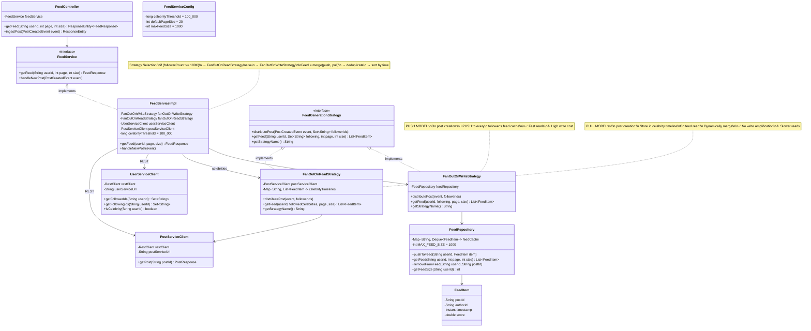
```mermaid
classDiagram
    direction TB

    class FeedController {
        -FeedService feedService
        +getFeed(String userId, int page, int size) ResponseEntity~FeedResponse~
        +ingestPost(PostCreatedEvent event) ResponseEntity
    }

    class FeedService {
        <<interface>>
        +getFeed(String userId, int page, int size) FeedResponse
        +handleNewPost(PostCreatedEvent event)
    }

    class FeedServiceImpl {
        -FanOutOnWriteStrategy fanOutOnWriteStrategy
        -FanOutOnReadStrategy fanOutOnReadStrategy
        -UserServiceClient userServiceClient
        -PostServiceClient postServiceClient
        -long celebrityThreshold = 100_000
        +getFeed(userId, page, size) FeedResponse
        +handleNewPost(event)
    }

    class FeedGenerationStrategy {
        <<interface>>
        +distributePost(PostCreatedEvent event, Set~String~ followerIds)
        +getFeed(String userId, Set~String~ following, int page, int size) List~FeedItem~
        +getStrategyName() String
    }

    class FanOutOnWriteStrategy {
        -FeedRepository feedRepository
        +distributePost(event, followerIds)
        +getFeed(userId, following, page, size) List~FeedItem~
        +getStrategyName() String
    }

    class FanOutOnReadStrategy {
        -PostServiceClient postServiceClient
        -Map~String, List~FeedItem~~ celebrityTimelines
        +distributePost(event, followerIds)
        +getFeed(userId, followedCelebrities, page, size) List~FeedItem~
        +getStrategyName() String
    }

    class FeedItem {
        -String postId
        -String authorId
        -Instant timestamp
        -double score
    }

    class FeedRepository {
        -Map~String, Deque~FeedItem~~ feedCache
        -int MAX_FEED_SIZE = 1000
        +pushToFeed(String userId, FeedItem item)
        +getFeed(String userId, int page, int size) List~FeedItem~
        +removeFromFeed(String userId, String postId)
        +getFeedSize(String userId) int
    }

    class UserServiceClient {
        -RestClient restClient
        -String userServiceUrl
        +getFollowerIds(String userId) Set~String~
        +getFollowingIds(String userId) Set~String~
        +isCelebrity(String userId) boolean
    }

    class PostServiceClient {
        -RestClient restClient
        -String postServiceUrl
        +getPost(String postId) PostResponse
    }

    class FeedServiceConfig {
        -long celebrityThreshold = 100_000
        -int defaultPageSize = 20
        -int maxFeedSize = 1000
    }

    FeedController --> FeedService
    FeedService <|.. FeedServiceImpl : implements
    FeedGenerationStrategy <|.. FanOutOnWriteStrategy : implements
    FeedGenerationStrategy <|.. FanOutOnReadStrategy : implements
    FeedServiceImpl --> FanOutOnWriteStrategy : normal users
    FeedServiceImpl --> FanOutOnReadStrategy : celebrities
    FeedServiceImpl --> UserServiceClient : REST
    FeedServiceImpl --> PostServiceClient : REST
    FanOutOnWriteStrategy --> FeedRepository
    FanOutOnReadStrategy --> PostServiceClient
    FeedRepository --> FeedItem

    note for FeedServiceImpl "Strategy Selection:\nif (followerCount >= 100K)\n  → FanOutOnReadStrategy\nelse\n  → FanOutOnWriteStrategy\n\nFeed = merge(push, pull)\n       → deduplicate\n       → sort by time"
    note for FanOutOnWriteStrategy "PUSH MODEL:\nOn post creation:\n  LPUSH to every\n  follower's feed cache\n\n✅ Fast reads\n⚠️ High write cost"
    note for FanOutOnReadStrategy "PULL MODEL:\nOn post creation:\n  Store in celebrity timeline\nOn feed read:\n  Dynamically merge\n\n✅ No write amplification\n⚠️ Slower reads"
```

---

### 8.5  Engagement Service — Class Diagram (Port 8084)

> Manages likes, comments, and shares. **Patterns: Factory (EngagementFactory), Decorator (ContentFilterChain)**

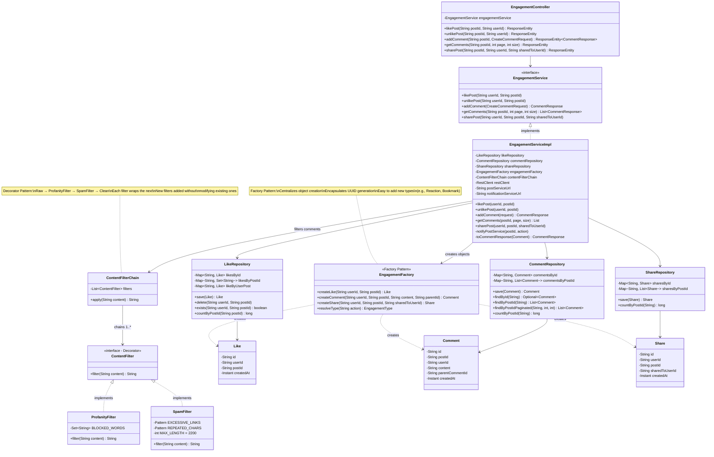
```mermaid
classDiagram
    direction TB

    class EngagementController {
        -EngagementService engagementService
        +likePost(String postId, String userId) ResponseEntity
        +unlikePost(String postId, String userId) ResponseEntity
        +addComment(String postId, CreateCommentRequest) ResponseEntity~CommentResponse~
        +getComments(String postId, int page, int size) ResponseEntity
        +sharePost(String postId, String userId, String sharedToUserId) ResponseEntity
    }

    class EngagementService {
        <<interface>>
        +likePost(String userId, String postId)
        +unlikePost(String userId, String postId)
        +addComment(CreateCommentRequest) CommentResponse
        +getComments(String postId, int page, int size) List~CommentResponse~
        +sharePost(String userId, String postId, String sharedToUserId)
    }

    class EngagementServiceImpl {
        -LikeRepository likeRepository
        -CommentRepository commentRepository
        -ShareRepository shareRepository
        -EngagementFactory engagementFactory
        -ContentFilterChain contentFilterChain
        -RestClient restClient
        -String postServiceUrl
        -String notificationServiceUrl
        +likePost(userId, postId)
        +unlikePost(userId, postId)
        +addComment(request) CommentResponse
        +getComments(postId, page, size) List
        +sharePost(userId, postId, sharedToUserId)
        -notifyPostService(postId, action)
        -toCommentResponse(Comment) CommentResponse
    }

    class EngagementFactory {
        <<Factory Pattern>>
        +createLike(String userId, String postId) Like
        +createComment(String userId, String postId, String content, String parentId) Comment
        +createShare(String userId, String postId, String sharedToUserId) Share
        +resolveType(String action) EngagementType
    }

    class ContentFilter {
        <<interface - Decorator>>
        +filter(String content) String
    }

    class ProfanityFilter {
        -Set~String~ BLOCKED_WORDS
        +filter(String content) String
    }

    class SpamFilter {
        -Pattern EXCESSIVE_LINKS
        -Pattern REPEATED_CHARS
        -int MAX_LENGTH = 2200
        +filter(String content) String
    }

    class ContentFilterChain {
        -List~ContentFilter~ filters
        +apply(String content) String
    }

    class Like {
        -String id
        -String userId
        -String postId
        -Instant createdAt
    }

    class Comment {
        -String id
        -String postId
        -String userId
        -String content
        -String parentCommentId
        -Instant createdAt
    }

    class Share {
        -String id
        -String userId
        -String postId
        -String sharedToUserId
        -Instant createdAt
    }

    class LikeRepository {
        -Map~String, Like~ likesById
        -Map~String, Set~String~~ likesByPostId
        -Map~String, Like~ likeByUserPost
        +save(Like) Like
        +delete(String userId, String postId)
        +exists(String userId, String postId) boolean
        +countByPostId(String postId) long
    }

    class CommentRepository {
        -Map~String, Comment~ commentsById
        -Map~String, List~Comment~~ commentsByPostId
        +save(Comment) Comment
        +findById(String) Optional~Comment~
        +findByPostId(String) List~Comment~
        +findByPostIdPaginated(String, int, int) List~Comment~
        +countByPostId(String) long
    }

    class ShareRepository {
        -Map~String, Share~ sharesById
        -Map~String, List~Share~~ sharesByPostId
        +save(Share) Share
        +countByPostId(String) long
    }

    EngagementController --> EngagementService
    EngagementService <|.. EngagementServiceImpl : implements
    EngagementServiceImpl --> EngagementFactory : creates objects
    EngagementServiceImpl --> ContentFilterChain : filters comments
    EngagementServiceImpl --> LikeRepository
    EngagementServiceImpl --> CommentRepository
    EngagementServiceImpl --> ShareRepository
    ContentFilterChain --> ContentFilter : chains 1..*
    ContentFilter <|.. ProfanityFilter : implements
    ContentFilter <|.. SpamFilter : implements
    EngagementFactory ..> Like : creates
    EngagementFactory ..> Comment : creates
    EngagementFactory ..> Share : creates
    LikeRepository --> Like
    CommentRepository --> Comment
    ShareRepository --> Share

    note for EngagementFactory "Factory Pattern:\nCentralizes object creation\nEncapsulates UUID generation\nEasy to add new types\n(e.g., Reaction, Bookmark)"
    note for ContentFilterChain "Decorator Pattern:\nRaw → ProfanityFilter → SpamFilter → Clean\nEach filter wraps the next\nNew filters added without\nmodifying existing ones"
```

---

### 8.6 🔍 Search Service — Class Diagram (Port 8085)

> Full-text and autocomplete search using custom data structures. **Data Structures: Trie (prefix search), Inverted Index (full-text AND search)**

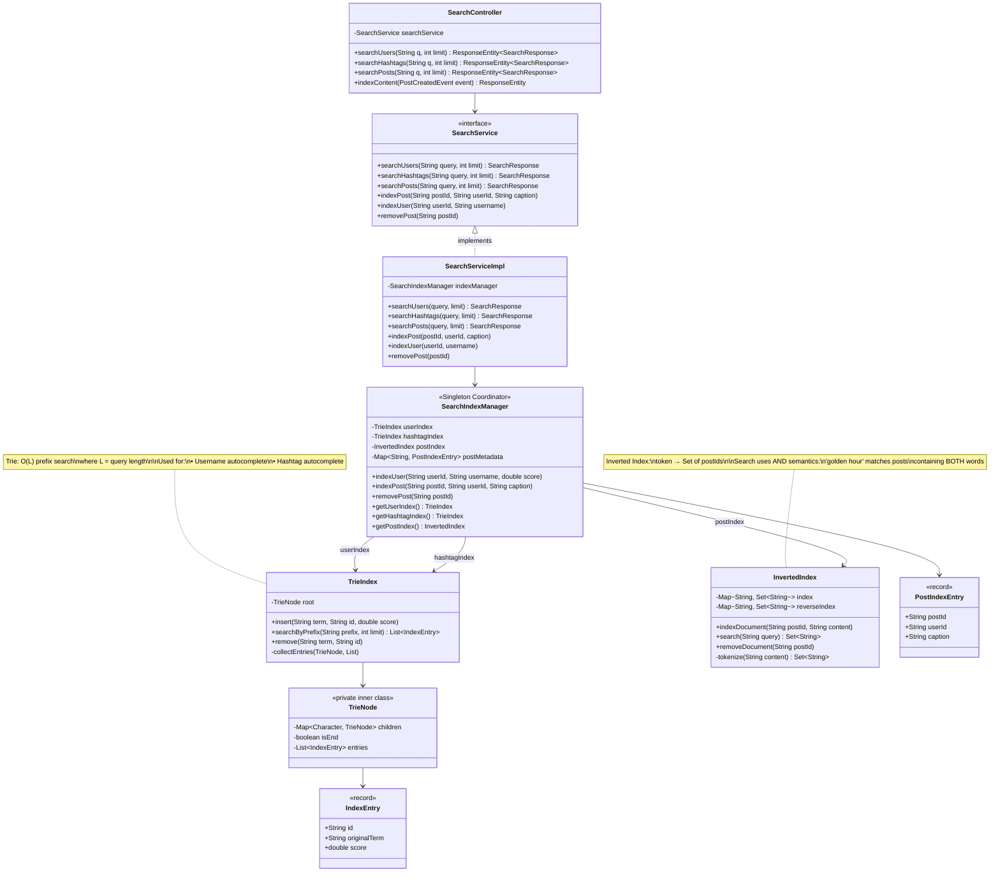
```mermaid
classDiagram
    direction TB

    class SearchController {
        -SearchService searchService
        +searchUsers(String q, int limit) ResponseEntity~SearchResponse~
        +searchHashtags(String q, int limit) ResponseEntity~SearchResponse~
        +searchPosts(String q, int limit) ResponseEntity~SearchResponse~
        +indexContent(PostCreatedEvent event) ResponseEntity
    }

    class SearchService {
        <<interface>>
        +searchUsers(String query, int limit) SearchResponse
        +searchHashtags(String query, int limit) SearchResponse
        +searchPosts(String query, int limit) SearchResponse
        +indexPost(String postId, String userId, String caption)
        +indexUser(String userId, String username)
        +removePost(String postId)
    }

    class SearchServiceImpl {
        -SearchIndexManager indexManager
        +searchUsers(query, limit) SearchResponse
        +searchHashtags(query, limit) SearchResponse
        +searchPosts(query, limit) SearchResponse
        +indexPost(postId, userId, caption)
        +indexUser(userId, username)
        +removePost(postId)
    }

    class SearchIndexManager {
        <<Singleton Coordinator>>
        -TrieIndex userIndex
        -TrieIndex hashtagIndex
        -InvertedIndex postIndex
        -Map~String, PostIndexEntry~ postMetadata
        +indexUser(String userId, String username, double score)
        +indexPost(String postId, String userId, String caption)
        +removePost(String postId)
        +getUserIndex() TrieIndex
        +getHashtagIndex() TrieIndex
        +getPostIndex() InvertedIndex
    }

    class TrieIndex {
        -TrieNode root
        +insert(String term, String id, double score)
        +searchByPrefix(String prefix, int limit) List~IndexEntry~
        +remove(String term, String id)
        -collectEntries(TrieNode, List)
    }

    class TrieNode {
        <<private inner class>>
        -Map~Character, TrieNode~ children
        -boolean isEnd
        -List~IndexEntry~ entries
    }

    class IndexEntry {
        <<record>>
        +String id
        +String originalTerm
        +double score
    }

    class InvertedIndex {
        -Map~String, Set~String~~ index
        -Map~String, Set~String~~ reverseIndex
        +indexDocument(String postId, String content)
        +search(String query) Set~String~
        +removeDocument(String postId)
        -tokenize(String content) Set~String~
    }

    class PostIndexEntry {
        <<record>>
        +String postId
        +String userId
        +String caption
    }

    SearchController --> SearchService
    SearchService <|.. SearchServiceImpl : implements
    SearchServiceImpl --> SearchIndexManager
    SearchIndexManager --> TrieIndex : userIndex
    SearchIndexManager --> TrieIndex : hashtagIndex
    SearchIndexManager --> InvertedIndex : postIndex
    SearchIndexManager --> PostIndexEntry
    TrieIndex --> TrieNode
    TrieNode --> IndexEntry

    note for TrieIndex "Trie: O(L) prefix search\nwhere L = query length\n\nUsed for:\n• Username autocomplete\n• Hashtag autocomplete"
    note for InvertedIndex "Inverted Index:\ntoken → Set of postIds\n\nSearch uses AND semantics:\n'golden hour' matches posts\ncontaining BOTH words"
```

---

### 8.7 🔔 Notification Service — Class Diagram (Port 8086)

> Event-driven notification management. **Pattern: Factory (NotificationFactory)** for creating typed notifications.

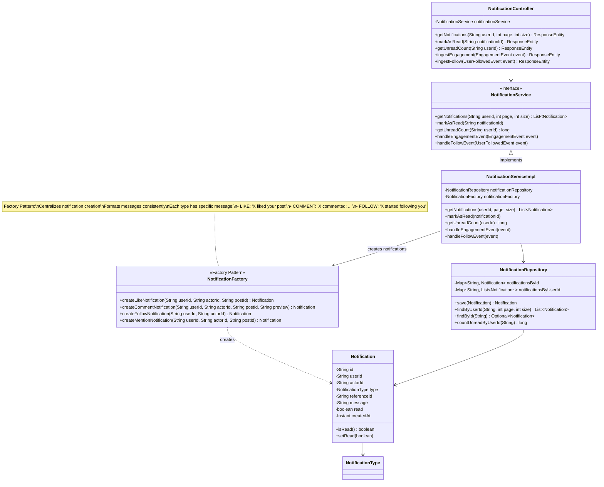
```mermaid
classDiagram
    direction TB

    class NotificationController {
        -NotificationService notificationService
        +getNotifications(String userId, int page, int size) ResponseEntity
        +markAsRead(String notificationId) ResponseEntity
        +getUnreadCount(String userId) ResponseEntity
        +ingestEngagement(EngagementEvent event) ResponseEntity
        +ingestFollow(UserFollowedEvent event) ResponseEntity
    }

    class NotificationService {
        <<interface>>
        +getNotifications(String userId, int page, int size) List~Notification~
        +markAsRead(String notificationId)
        +getUnreadCount(String userId) long
        +handleEngagementEvent(EngagementEvent event)
        +handleFollowEvent(UserFollowedEvent event)
    }

    class NotificationServiceImpl {
        -NotificationRepository notificationRepository
        -NotificationFactory notificationFactory
        +getNotifications(userId, page, size) List~Notification~
        +markAsRead(notificationId)
        +getUnreadCount(userId) long
        +handleEngagementEvent(event)
        +handleFollowEvent(event)
    }

    class NotificationFactory {
        <<Factory Pattern>>
        +createLikeNotification(String userId, String actorId, String postId) Notification
        +createCommentNotification(String userId, String actorId, String postId, String preview) Notification
        +createFollowNotification(String userId, String actorId) Notification
        +createMentionNotification(String userId, String actorId, String postId) Notification
    }

    class Notification {
        -String id
        -String userId
        -String actorId
        -NotificationType type
        -String referenceId
        -String message
        -boolean read
        -Instant createdAt
        +isRead() boolean
        +setRead(boolean)
    }

    class NotificationRepository {
        -Map~String, Notification~ notificationsById
        -Map~String, List~Notification~~ notificationsByUserId
        +save(Notification) Notification
        +findByUserId(String, int page, int size) List~Notification~
        +findById(String) Optional~Notification~
        +countUnreadByUserId(String) long
    }

    NotificationController --> NotificationService
    NotificationService <|.. NotificationServiceImpl : implements
    NotificationServiceImpl --> NotificationRepository
    NotificationServiceImpl --> NotificationFactory : creates notifications
    NotificationFactory ..> Notification : creates
    NotificationRepository --> Notification
    Notification --> NotificationType

    note for NotificationFactory "Factory Pattern:\nCentralizes notification creation\nFormats messages consistently\nEach type has specific message:\n• LIKE: 'X liked your post'\n• COMMENT: 'X commented: ...'\n• FOLLOW: 'X started following you'"
```

---

### 8.8 🔀 API Gateway — Class Diagram (Port 8080)

> Single entry point for all client requests. **Patterns: Facade (unified API), Chain of Responsibility (filter pipeline)**

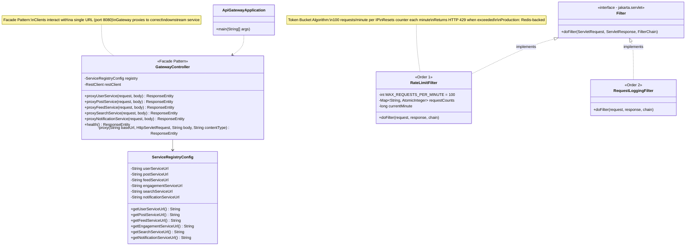
```mermaid
classDiagram
    direction TB

    class ApiGatewayApplication {
        +main(String[] args)
    }

    class GatewayController {
        <<Facade Pattern>>
        -ServiceRegistryConfig registry
        -RestClient restClient
        +proxyUserService(request, body) ResponseEntity
        +proxyPostService(request, body) ResponseEntity
        +proxyFeedService(request, body) ResponseEntity
        +proxySearchService(request, body) ResponseEntity
        +proxyNotificationService(request, body) ResponseEntity
        +health() ResponseEntity
        -proxy(String baseUrl, HttpServletRequest, String body, String contentType) ResponseEntity
    }

    class ServiceRegistryConfig {
        -String userServiceUrl
        -String postServiceUrl
        -String feedServiceUrl
        -String engagementServiceUrl
        -String searchServiceUrl
        -String notificationServiceUrl
        +getUserServiceUrl() String
        +getPostServiceUrl() String
        +getFeedServiceUrl() String
        +getEngagementServiceUrl() String
        +getSearchServiceUrl() String
        +getNotificationServiceUrl() String
    }

    class Filter {
        <<interface - jakarta.servlet>>
        +doFilter(ServletRequest, ServletResponse, FilterChain)
    }

    class RateLimitFilter {
        <<Order 1>>
        -int MAX_REQUESTS_PER_MINUTE = 100
        -Map~String, AtomicInteger~ requestCounts
        -long currentMinute
        +doFilter(request, response, chain)
    }

    class RequestLoggingFilter {
        <<Order 2>>
        +doFilter(request, response, chain)
    }

    Filter <|.. RateLimitFilter : implements
    Filter <|.. RequestLoggingFilter : implements
    GatewayController --> ServiceRegistryConfig
    ApiGatewayApplication ..> GatewayController

    note for GatewayController "Facade Pattern:\nClients interact with\na single URL (port 8080)\nGateway proxies to correct\ndownstream service"
    note for RateLimitFilter "Token Bucket Algorithm:\n100 requests/minute per IP\nResets counter each minute\nReturns HTTP 429 when exceeded\n\nProduction: Redis-backed"
```

---

## 9. 💾 Database Design (ER Diagram)

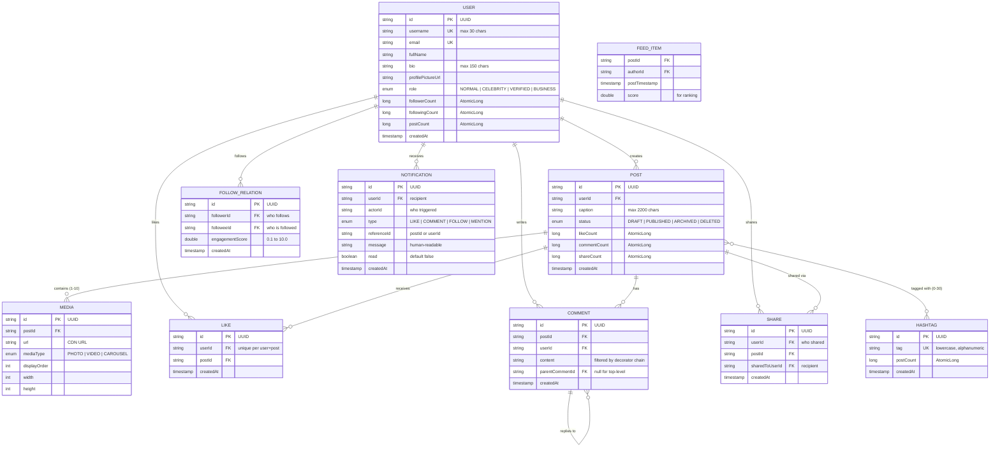
```mermaid
erDiagram
    USER {
        string id PK "UUID"
        string username UK "max 30 chars"
        string email UK
        string fullName
        string bio "max 150 chars"
        string profilePictureUrl
        enum role "NORMAL | CELEBRITY | VERIFIED | BUSINESS"
        long followerCount "AtomicLong"
        long followingCount "AtomicLong"
        long postCount "AtomicLong"
        timestamp createdAt
    }

    POST {
        string id PK "UUID"
        string userId FK
        string caption "max 2200 chars"
        enum status "DRAFT | PUBLISHED | ARCHIVED | DELETED"
        long likeCount "AtomicLong"
        long commentCount "AtomicLong"
        long shareCount "AtomicLong"
        timestamp createdAt
    }

    MEDIA {
        string id PK "UUID"
        string postId FK
        string url "CDN URL"
        enum mediaType "PHOTO | VIDEO | CAROUSEL"
        int displayOrder
        int width
        int height
    }

    FOLLOW_RELATION {
        string id PK "UUID"
        string followerId FK "who follows"
        string followeeId FK "who is followed"
        double engagementScore "0.1 to 10.0"
        timestamp createdAt
    }

    LIKE {
        string id PK "UUID"
        string userId FK "unique per user+post"
        string postId FK
        timestamp createdAt
    }

    COMMENT {
        string id PK "UUID"
        string postId FK
        string userId FK
        string content "filtered by decorator chain"
        string parentCommentId FK "null for top-level"
        timestamp createdAt
    }

    SHARE {
        string id PK "UUID"
        string userId FK "who shared"
        string postId FK
        string sharedToUserId FK "recipient"
        timestamp createdAt
    }

    HASHTAG {
        string id PK "UUID"
        string tag UK "lowercase, alphanumeric"
        long postCount "AtomicLong"
        timestamp createdAt
    }

    FEED_ITEM {
        string postId FK
        string authorId FK
        timestamp postTimestamp
        double score "for ranking"
    }

    NOTIFICATION {
        string id PK "UUID"
        string userId FK "recipient"
        string actorId "who triggered"
        enum type "LIKE | COMMENT | FOLLOW | MENTION"
        string referenceId "postId or userId"
        string message "human-readable"
        boolean read "default false"
        timestamp createdAt
    }

    USER ||--o{ POST : "creates"
    USER ||--o{ FOLLOW_RELATION : "follows"
    USER ||--o{ LIKE : "likes"
    USER ||--o{ COMMENT : "writes"
    USER ||--o{ SHARE : "shares"
    USER ||--o{ NOTIFICATION : "receives"
    POST ||--o{ MEDIA : "contains (1-10)"
    POST ||--o{ LIKE : "receives"
    POST ||--o{ COMMENT : "has"
    POST ||--o{ SHARE : "shared via"
    POST }o--o{ HASHTAG : "tagged with (0-30)"
    COMMENT ||--o{ COMMENT : "replies to"
```

---

## 10. ✅ SOLID Principles

| Principle | Where | How |
|-----------|-------|-----|
| **S** — Single Responsibility | Each microservice | User Service ≠ Post Service ≠ Feed Service. Each owns exactly one bounded context |
| **O** — Open/Closed | Feed Strategy | Add `MLRankedStrategy` without touching `FeedServiceImpl`. Just implement `FeedGenerationStrategy` |
| **L** — Liskov Substitution | Strategy + Factory | `FanOutOnWrite` and `FanOutOnRead` are interchangeable. Any `ContentFilter` works in the chain |
| **I** — Interface Segregation | User module | `UserService` (profile CRUD) and `FollowService` (social graph) are separate interfaces |
| **D** — Dependency Inversion | All services | `PostController` depends on `PostService` interface, not `PostServiceImpl`. Swappable |

---

## 11. 📈 Scaling Strategy

### Service Scaling Matrix

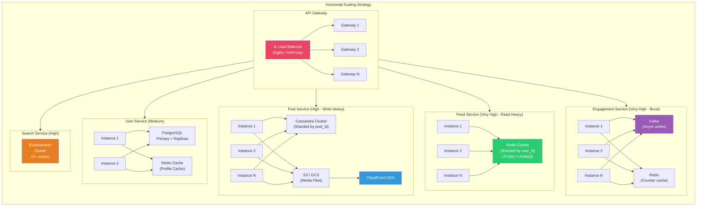
```mermaid
flowchart TB
    subgraph SCALE["Horizontal Scaling Strategy"]
        direction TB

        subgraph GW_SCALE["API Gateway"]
            GW1["Gateway 1"]
            GW2["Gateway 2"]
            GW3["Gateway N"]
            LB_GW["⚖️ Load Balancer<br/>(Nginx / HAProxy)"]
            LB_GW --> GW1 & GW2 & GW3
        end

        subgraph US_SCALE["User Service (Medium)"]
            US1["Instance 1"]
            US2["Instance 2"]
            US_DB["PostgreSQL<br/>Primary + Replicas"]
            US_CACHE["Redis Cache<br/>(Profile Cache)"]
            US1 & US2 --> US_DB
            US1 & US2 --> US_CACHE
        end

        subgraph PS_SCALE["Post Service (High - Write Heavy)"]
            PS1["Instance 1"]
            PS2["Instance 2"]
            PS3["Instance N"]
            PS_DB["Cassandra Cluster<br/>(Sharded by post_id)"]
            PS_S3["S3 / GCS<br/>(Media Files)"]
            PS_CDN["CloudFront CDN"]
            PS1 & PS2 & PS3 --> PS_DB
            PS1 & PS2 & PS3 --> PS_S3
            PS_S3 --> PS_CDN
        end

        subgraph FS_SCALE["Feed Service (Very High - Read Heavy)"]
            FS1["Instance 1"]
            FS2["Instance 2"]
            FS3["Instance N"]
            FS_REDIS["Redis Cluster<br/>(Sharded by user_id)<br/>LPUSH / LRANGE"]
            FS1 & FS2 & FS3 --> FS_REDIS
        end

        subgraph ES_SCALE["Engagement Service (Very High - Burst)"]
            ES1["Instance 1"]
            ES2["Instance 2"]
            ES3["Instance N"]
            ES_KAFKA["Kafka<br/>(Async writes)"]
            ES_REDIS["Redis<br/>(Counter cache)"]
            ES1 & ES2 & ES3 --> ES_KAFKA
            ES1 & ES2 & ES3 --> ES_REDIS
        end

        subgraph SS_SCALE["Search Service (High)"]
            SS_ES["Elasticsearch<br/>Cluster<br/>(3+ nodes)"]
        end

    end

    GW_SCALE --> US_SCALE & PS_SCALE & FS_SCALE & ES_SCALE & SS_SCALE

    style LB_GW fill:#e94560,color:#fff
    style FS_REDIS fill:#2ecc71,color:#fff
    style ES_KAFKA fill:#9b59b6,color:#fff
    style PS_CDN fill:#3498db,color:#fff
    style SS_ES fill:#e67e22,color:#fff
```

### Scaling Details Per Service

| Service | Load Profile | Scaling Approach | Data Sharding |
|---------|-------------|-----------------|---------------|
| **API Gateway** | ~50B req/day | Stateless → horizontal, behind load balancer | N/A (stateless) |
| **User Service** | Medium (auth-heavy) | 2-5 instances, read replicas for profile queries | Shard by `user_id % N` |
| **Post Service** | High (100M writes/day) | 5-10 instances, async media processing | Shard by `post_id % N`, Cassandra |
| **Feed Service** | Very High (50B reads/day) | 10-20 instances, Redis cluster for feed cache | Shard feed cache by `user_id % N` |
| **Engagement Service** | Very High (burst pattern) | 10-15 instances, Kafka async writes, Redis counters | Shard by `post_id` for counts |
| **Search Service** | High (autocomplete QPS) | Elasticsearch cluster, 3-7 nodes | Auto-sharded by ES |
| **Notification Service** | Medium (async, event-driven) | 3-5 Kafka consumer instances, batch writes | Shard by `user_id` |

### Bottleneck Mitigation

```mermaid
flowchart LR
    subgraph BOTTLENECK["Identified Bottlenecks"]
        B1["Feed writes for<br/>celebrity posts"]
        B2["Like counter storms<br/>on viral posts"]
        B3["Feed read latency<br/>for new users"]
        B4["Search indexing<br/>lag"]
    end

    subgraph SOLUTION["Mitigation Strategy"]
        S1["FanOutOnRead strategy<br/>→ No write amplification"]
        S2["Redis atomic counters<br/>→ Async DB flush"]
        S3["Pre-warm cache<br/>→ Populate on follow"]
        S4["Kafka buffering<br/>→ Batch index updates"]
    end

    B1 --> S1
    B2 --> S2
    B3 --> S3
    B4 --> S4

    style B1 fill:#e74c3c,color:#fff
    style B2 fill:#e74c3c,color:#fff
    style B3 fill:#e74c3c,color:#fff
    style B4 fill:#e74c3c,color:#fff
    style S1 fill:#2ecc71,color:#fff
    style S2 fill:#2ecc71,color:#fff
    style S3 fill:#2ecc71,color:#fff
    style S4 fill:#2ecc71,color:#fff
```

### Capacity Estimates

| Metric | Value | Implication |
|--------|-------|-------------|
| MAU | 2 Billion | Massive user base → shard user DB |
| DAU | 500 Million | 500M concurrent sessions → horizontal scaling |
| Posts/day | 100M | 1,157 writes/sec → Cassandra + async |
| Feed reads/day | 50B | 578K reads/sec → Redis cluster |
| Storage/day | 280 TB | S3 multi-region replication |
| Metadata/year | 90 TB | PostgreSQL + Cassandra |
| Feed cache | 2 TB | Redis cluster (hot posts) |

### Production Architecture Comparison

| Component | LLD (This Project) | Production Equivalent |
|-----------|-------------------|-----------------------|
| **Data Store** | `ConcurrentHashMap` | PostgreSQL + Cassandra + Redis |
| **Event Bus** | REST calls (Observer pattern) | Apache Kafka (100K+ msgs/sec) |
| **Feed Cache** | `ArrayDeque` (in-memory) | Redis Sorted Sets (ZADD/ZRANGE) |
| **Search** | Custom Trie + InvertedIndex | Elasticsearch cluster |
| **Media Storage** | Simulated CDN URLs | AWS S3 + CloudFront CDN |
| **Service Discovery** | Hardcoded port URLs | Consul / Eureka / K8s DNS |
| **Rate Limiting** | In-process token bucket | Redis-backed distributed limiter |
| **Auth** | Simulated | OAuth2 / JWT + Spring Security |
| **Monitoring** | Slf4j logging | Prometheus + Grafana + ELK |
| **Deployment** | Local JVM per service | Kubernetes pods (auto-scaling) |
| **CI/CD** | Manual Maven build | GitHub Actions → Docker → K8s |

---

## 12. 📡 API Reference

### User Service `:8081`
| Method | Endpoint | Description |
|--------|----------|-------------|
| `POST` | `/api/v1/users` | Register user |
| `GET` | `/api/v1/users/{userId}` | Get profile |
| `PUT` | `/api/v1/users/{userId}` | Update profile |
| `POST` | `/api/v1/users/{followeeId}/follow?followerId=` | Follow user |
| `DELETE` | `/api/v1/users/{followeeId}/follow?followerId=` | Unfollow user |
| `GET` | `/api/v1/users/{userId}/followers` | Get follower profiles |
| `GET` | `/api/v1/users/{userId}/following` | Get following profiles |
| `GET` | `/api/v1/users/{userId}/followers/ids` | Get follower IDs |
| `GET` | `/api/v1/users/{userId}/following/ids` | Get following IDs |
| `GET` | `/api/v1/users/{userId}/is-celebrity` | Check celebrity status |
| `GET` | `/api/v1/users/search?q=` | Search users by prefix |

### Post Service `:8082`
| Method | Endpoint | Description |
|--------|----------|-------------|
| `POST` | `/api/v1/posts` | Create post (Builder pattern) |
| `GET` | `/api/v1/posts/{postId}` | Get post by ID |
| `DELETE` | `/api/v1/posts/{postId}?userId=` | Delete post |
| `GET` | `/api/v1/users/{userId}/posts?page=&size=` | Get user's posts |
| `POST` | `/api/v1/media/presigned-url?fileName=&contentType=` | Get upload URL |
| `POST` | `/api/v1/posts/{postId}/increment-like` | *(internal)* |
| `POST` | `/api/v1/posts/{postId}/decrement-like` | *(internal)* |
| `POST` | `/api/v1/posts/{postId}/increment-comment` | *(internal)* |
| `POST` | `/api/v1/posts/{postId}/increment-share` | *(internal)* |

### Feed Service `:8083`
| Method | Endpoint | Description |
|--------|----------|-------------|
| `GET` | `/api/v1/feed?userId=&page=&size=` | Get personalized feed |
| `POST` | `/api/v1/feed/ingest` | *(internal)* Receive new post event |

### Engagement Service `:8084`
| Method | Endpoint | Description |
|--------|----------|-------------|
| `POST` | `/api/v1/posts/{postId}/likes?userId=` | Like post |
| `DELETE` | `/api/v1/posts/{postId}/likes?userId=` | Unlike post |
| `POST` | `/api/v1/posts/{postId}/comments` | Add comment |
| `GET` | `/api/v1/posts/{postId}/comments?page=&size=` | Get comments |
| `POST` | `/api/v1/posts/{postId}/shares?userId=&sharedToUserId=` | Share post |

### Search Service `:8085`
| Method | Endpoint | Description |
|--------|----------|-------------|
| `GET` | `/api/v1/search/users?q=&limit=` | Search users (Trie) |
| `GET` | `/api/v1/search/hashtags?q=&limit=` | Search hashtags (Trie) |
| `GET` | `/api/v1/search/posts?q=&limit=` | Search posts (InvertedIndex) |
| `POST` | `/api/v1/search/index` | *(internal)* Index new content |

### Notification Service `:8086`
| Method | Endpoint | Description |
|--------|----------|-------------|
| `GET` | `/api/v1/notifications?userId=&page=&size=` | Get notifications |
| `PUT` | `/api/v1/notifications/{id}/read` | Mark as read |
| `GET` | `/api/v1/notifications/unread-count?userId=` | Get unread count |
| `POST` | `/api/v1/notifications/ingest/engagement` | *(internal)* |
| `POST` | `/api/v1/notifications/ingest/follow` | *(internal)* |

---

## 13. 🚀 How to Run

### Prerequisites
- Java 17+
- Maven 3.8+

### Build All Modules
```bash
./mvnw clean compile
```

### Start Services (each in a separate terminal)
```bash
# Terminal 1 — User Service
cd user-service && ../mvnw spring-boot:run

# Terminal 2 — Post Service
cd post-service && ../mvnw spring-boot:run

# Terminal 3 — Feed Service
cd feed-service && ../mvnw spring-boot:run

# Terminal 4 — Engagement Service
cd engagement-service && ../mvnw spring-boot:run

# Terminal 5 — Search Service
cd search-service && ../mvnw spring-boot:run

# Terminal 6 — Notification Service
cd notification-service && ../mvnw spring-boot:run

# Terminal 7 — API Gateway
cd api-gateway && ../mvnw spring-boot:run
```

### Test API Flow
```bash
# 1. Register users
curl -s -X POST http://localhost:8081/api/v1/users \
  -H "Content-Type: application/json" \
  -d '{"username":"john_doe","email":"john@example.com","fullName":"John Doe","bio":"Photographer"}' | jq .

curl -s -X POST http://localhost:8081/api/v1/users \
  -H "Content-Type: application/json" \
  -d '{"username":"sarah_designs","email":"sarah@example.com","fullName":"Sarah","bio":"Designer"}' | jq .

# 2. Follow a user (john follows sarah)
curl -s -X POST "http://localhost:8081/api/v1/users/<SARAH_ID>/follow?followerId=<JOHN_ID>" | jq .

# 3. Create a post (sarah posts)
curl -s -X POST http://localhost:8082/api/v1/posts \
  -H "Content-Type: application/json" \
  -d '{"userId":"<SARAH_ID>","caption":"New design project! #design #creative","mediaItems":[{"url":"https://cdn.example.com/photo.jpg","mediaType":"PHOTO","width":1080,"height":1080}]}' | jq .

# 4. Get John's feed (should contain Sarah's post)
curl -s "http://localhost:8083/api/v1/feed?userId=<JOHN_ID>&page=0&size=20" | jq .

# 5. Like the post
curl -s -X POST "http://localhost:8084/api/v1/posts/<POST_ID>/likes?userId=<JOHN_ID>" | jq .

# 6. Comment on the post
curl -s -X POST "http://localhost:8084/api/v1/posts/<POST_ID>/comments" \
  -H "Content-Type: application/json" \
  -d '{"userId":"<JOHN_ID>","content":"Amazing design!"}' | jq .

# 7. Search for users
curl -s "http://localhost:8085/api/v1/search/users?q=john" | jq .
```

---

## 14. 🗺️ Production Upgrades Roadmap

```mermaid
timeline
    title Instagram LLD → Production Roadmap
    section Phase 1 (Current)
        In-Memory Storage : ConcurrentHashMap
        Sync REST : Inter-service calls
        Single Instance : Each service
    section Phase 2
        Database Layer : PostgreSQL + Cassandra
        Message Queue : Apache Kafka
        Caching : Redis Cluster
    section Phase 3
        Service Discovery : Consul / Eureka
        Auth : OAuth2 + JWT
        Monitoring : Prometheus + Grafana
    section Phase 4
        Containerization : Docker + K8s
        CDN : CloudFront
        CI/CD : GitHub Actions
    section Phase 5
        ML Ranking : Feed personalization
        Geo-Distribution : Multi-region
        Auto-scaling : K8s HPA
```

---

## 📊 Project Stats

| Metric | Value |
|--------|-------|
| Total Java Files | **67** |
| Maven Modules | **8** |
| Design Patterns | **7** (Strategy, Observer, Factory, Builder, Decorator, Singleton, Facade) |
| REST Endpoints | **35+** |
| Domain Entities | **10** |
| Service Interfaces | **9** |
| Spring Boot Apps | **7** (+ 1 shared JAR) |

---

## 📜 License

This project is for educational purposes — demonstrating production-grade Low-Level Design with microservice architecture for system design interviews.
