# 📸 Instagram LLD — Complete Working & Flow Guide

> This document is a **comprehensive walkthrough** of how every feature in the Instagram LLD works — from the moment a user hits an API endpoint to the final response. Every internal step, every service call, every design pattern invocation is explained with actual code references and flow diagrams.

---

## 📋 Table of Contents

1. [Application Startup & Service Registry](#1--application-startup--service-registry)
2. [Request Lifecycle Through API Gateway](#2--request-lifecycle-through-api-gateway)
3. [Flow 1: User Registration](#3--flow-1-user-registration)
4. [Flow 2: Follow / Unfollow a User](#4--flow-2-follow--unfollow-a-user)
5. [Flow 3: Creating a Post (The Core Flow)](#5--flow-3-creating-a-post-the-core-flow)
6. [Flow 4: Feed Generation (The Most Complex Flow)](#6--flow-4-feed-generation-the-most-complex-flow)
7. [Flow 5: Liking a Post](#7--flow-5-liking-a-post)
8. [Flow 6: Commenting on a Post](#8--flow-6-commenting-on-a-post)
9. [Flow 7: Sharing a Post](#9--flow-7-sharing-a-post)
10. [Flow 8: Searching (Users, Hashtags, Posts)](#10--flow-8-searching-users-hashtags-posts)
11. [Flow 9: Notifications](#11--flow-9-notifications)
12. [Flow 10: Media Upload (Pre-signed URL)](#12--flow-10-media-upload-pre-signed-url)
13. [How Data Flows Between Services](#13--how-data-flows-between-services)
14. [Thread Safety & Concurrency Model](#14--thread-safety--concurrency-model)
15. [Error Handling Across Services](#15--error-handling-across-services)
16. [Complete End-to-End Walkthrough](#16--complete-end-to-end-walkthrough)

---

## 1. 🚀 Application Startup & Service Registry

### How Services Boot Up

Each microservice is an independent Spring Boot application with its own `@SpringBootApplication` entry point, embedded Tomcat, and isolated classpath. They start on pre-assigned ports:

```
Port 8080 → API Gateway      (api-gateway/ApiGatewayApplication.java)
Port 8081 → User Service      (user-service/UserServiceApplication.java)
Port 8082 → Post Service      (post-service/PostServiceApplication.java)
Port 8083 → Feed Service      (feed-service/FeedServiceApplication.java)
Port 8084 → Engagement Service (engagement-service/EngagementServiceApplication.java)
Port 8085 → Search Service    (search-service/SearchServiceApplication.java)
Port 8086 → Notification Service (notification-service/NotificationServiceApplication.java)
```

### Boot Sequence Per Service

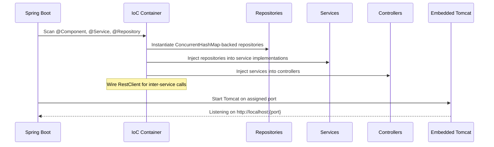

### What Happens in Post Service at Startup

Post Service has a special boot step — the **Observer pattern** registration:

```
1. Spring creates PostRepository, MediaRepository, HashtagRepository (ConcurrentHashMaps)
2. Spring creates PostEventPublisher (empty listener list)
3. Spring creates PostEventNotifier (concrete observer)
4. PostEventNotifier's @PostConstruct runs → registers itself with PostEventPublisher
5. PostServiceImpl is created with all dependencies injected
6. PostController is created with PostService + MediaService injected
```

After startup, the Observer pattern is wired:
```
PostEventPublisher.listeners = [PostEventNotifier]
→ When publishPostCreated() is called, PostEventNotifier.onPostCreated() fires
→ PostEventNotifier sends REST POST to FeedService (:8083) and SearchService (:8085)
```

### Service Discovery (Current vs Production)

| Aspect | Current (LLD) | Production |
|--------|--------------|------------|
| Discovery | Hardcoded URLs in `application.properties` | Consul / Eureka / K8s DNS |
| Format | `instagram.user-service.url=http://localhost:8081` | Service mesh (Istio) |
| Client | `RestClient.create()` | `RestClient` with service discovery |

---

## 2. 🔀 Request Lifecycle Through API Gateway

Every client request passes through the **API Gateway** (port 8080) before reaching any microservice.

### Gate Pipeline (Filter Chain)

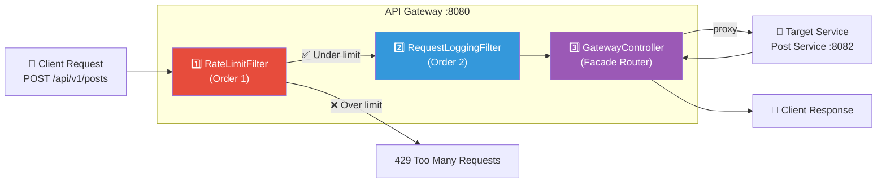

### Step 1: Rate Limiting (RateLimitFilter)

**Algorithm: Token Bucket** — each client IP gets 100 requests per minute.

```
How it works:
1. Extract client IP from request (request.getRemoteAddr())
2. Get current minute: System.currentTimeMillis() / 60000
3. If minute has changed → reset all counters
4. Get AtomicInteger counter for this IP
5. If counter >= 100 → return HTTP 429 (Too Many Requests)
6. Else → counter.incrementAndGet() → pass to next filter
```

### Step 2: Request Logging (RequestLoggingFilter)

Logs every request for observability:
```
[INFO] Incoming: GET /api/v1/users/abc123 from 192.168.1.1
[INFO] Response: 200 in 23ms
```

### Step 3: Facade Routing (GatewayController)

The Gateway determines which downstream service to call based on the URL path:

```
/api/v1/users/**       → proxy to http://localhost:8081 (User Service)
/api/v1/posts/**       → proxy to http://localhost:8082 (Post Service)
/api/v1/feed/**        → proxy to http://localhost:8083 (Feed Service)
/api/v1/engagement/**  → proxy to http://localhost:8084 (Engagement Service)
/api/v1/search/**      → proxy to http://localhost:8085 (Search Service)
/api/v1/notifications/**→ proxy to http://localhost:8086 (Notification Service)
```

The proxy method:
```
1. Receives the original HttpServletRequest
2. Builds a new RestClient request with the same method, headers, body
3. Forwards to the target service URL
4. Returns the downstream response directly to the client
```

---

## 3. 👤 Flow 1: User Registration

### HTTP Request
```http
POST /api/v1/users
Content-Type: application/json

{
  "username": "john_doe",
  "email": "john@example.com",
  "fullName": "John Doe",
  "bio": "Street photographer",
  "profilePictureUrl": "https://cdn.example.com/john.jpg"
}
```

### Internal Flow

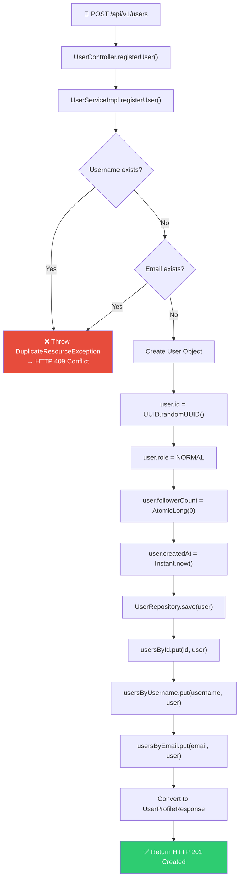

### What Gets Stored (UserRepository)

UserRepository maintains **three concurrent indexes** for O(1) lookups:

```
usersById:        ConcurrentHashMap<String, User>       key = UUID
usersByUsername:   ConcurrentHashMap<String, User>       key = "john_doe"
usersByEmail:     ConcurrentHashMap<String, User>       key = "john@example.com"
```

All three maps point to the **same User object** in memory, so updating one field (like followerCount) is reflected across all lookups.

### Response
```json
{
  "userId": "a1b2c3d4-...",
  "username": "john_doe",
  "fullName": "John Doe",
  "bio": "Street photographer",
  "role": "NORMAL",
  "followerCount": 0,
  "followingCount": 0,
  "postCount": 0,
  "createdAt": "2025-04-14T01:00:00Z"
}
```

---

## 4. 🤝 Flow 2: Follow / Unfollow a User

### HTTP Request
```http
POST /api/v1/users/{followeeId}/follow?followerId={followerId}
```

### Internal Flow

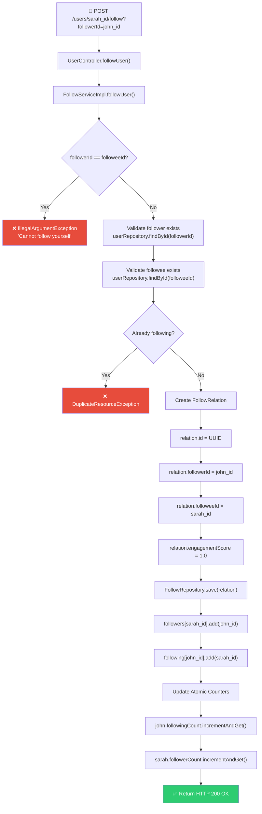

### FollowRepository Data Structure

```
followersByUserId:    ConcurrentHashMap<String, Set<String>>
  "sarah_id" → ConcurrentHashSet{"john_id", "alice_id", "bob_id"}
  
followingByUserId:    ConcurrentHashMap<String, Set<String>>
  "john_id" → ConcurrentHashSet{"sarah_id", "taylor_swift_id"}
  
followRelations:      ConcurrentHashMap<String, FollowRelation>
  "john_id:sarah_id" → FollowRelation{id, followerId, followeeId, score, timestamp}
```

### Why This Matters for Feed

The follow graph is the **foundation** of feed generation:
- When John opens his feed, FeedService calls `UserService.getFollowingIds("john_id")`
- This returns `{"sarah_id", "taylor_swift_id"}`
- FeedService then fetches posts from these users using the appropriate strategy

---

## 5. 📝 Flow 3: Creating a Post (The Core Flow)

> This is the most complex write flow — it involves **4 services** and **3 design patterns** (Builder, Observer, Strategy).

### HTTP Request
```http
POST /api/v1/posts
Content-Type: application/json

{
  "userId": "sarah_id",
  "caption": "Golden hour in Santorini ☀️ #travel #photography #summer",
  "mediaItems": [
    {
      "url": "https://cdn.example.com/santorini_1.jpg",
      "mediaType": "PHOTO",
      "width": 1080,
      "height": 1350
    },
    {
      "url": "https://cdn.example.com/santorini_2.jpg",
      "mediaType": "PHOTO",
      "width": 1080,
      "height": 1080
    }
  ]
}
```

### Complete Flow Across All Services

```mermaid
sequenceDiagram
    actor Sarah
    participant PS as 📝 Post Service :8082
    participant PRepo as PostRepository
    participant MRepo as MediaRepository
    participant HRepo as HashtagRepository
    participant US as 👤 User Service :8081
    participant PEP as 📢 PostEventPublisher
    participant PEN as 📡 PostEventNotifier
    participant FS as 📰 Feed Service :8083
    participant SS as 🔍 Search Service :8085
    participant FRepo as FeedRepository

    Sarah->>PS: POST /api/v1/posts {caption, media}
    
    Note over PS: === STEP 1: Extract Hashtags ===
    PS->>PS: regex #(\w+) on caption
    PS->>PS: Found: ["travel", "photography", "summer"]

    Note over PS: === STEP 2: Build Media ===
    loop For each MediaItem
        PS->>PS: Create Media(UUID, postId, url, PHOTO, order, w, h)
        PS->>MRepo: save(media) → mediaById.put()
    end

    Note over PS: === STEP 3: Builder Pattern ===
    rect rgb(40, 40, 80)
        PS->>PS: new Post.Builder(postId, "sarah_id")
        PS->>PS: .caption("Golden hour in Santorini...")
        PS->>PS: .mediaList([media1, media2])
        PS->>PS: .hashtags(["travel", "photography", "summer"])
        PS->>PS: .status(PUBLISHED)
        PS->>PS: .build() → Post object
    end

    PS->>PRepo: save(post) → postsById.put()
    PS->>PRepo: postIdsByUserId["sarah_id"].add(postId)

    Note over PS: === STEP 4: Index Hashtags ===
    loop For each hashtag
        PS->>HRepo: getOrCreate("travel") → Hashtag{tag, AtomicLong}
        HRepo->>HRepo: postCount.incrementAndGet()
    end

    Note over PS: === STEP 5: Update User Post Count ===
    PS->>US: POST /users/sarah_id/increment-post-count
    US->>US: sarah.postCount.incrementAndGet()
    US-->>PS: 200 OK

    Note over PS: === STEP 6: Observer Pattern ===
    rect rgb(80, 40, 80)
        PS->>PEP: publishPostCreated(PostCreatedEvent)
        PEP->>PEN: onPostCreated(event)
        
        Note over PEN: Notify Feed Service
        PEN->>FS: POST /api/v1/feed/ingest {postId, userId, caption, followerCount}
        
        Note over PEN: Notify Search Service
        PEN->>SS: POST /api/v1/search/index {postId, userId, caption}
    end

    Note over FS: === STEP 7: Feed Distribution (Strategy) ===
    rect rgb(40, 80, 40)
        FS->>US: GET /users/sarah_id/followers/ids
        US-->>FS: ["john_id", "alice_id", "bob_id"]
        FS->>US: GET /users/sarah_id/is-celebrity
        US-->>FS: false (500 followers)
        
        Note over FS: followerCount < 100K → FanOutOnWriteStrategy
        loop For each follower
            FS->>FRepo: pushToFeed("john_id", FeedItem)
            FS->>FRepo: pushToFeed("alice_id", FeedItem)
            FS->>FRepo: pushToFeed("bob_id", FeedItem)
        end
        FS->>FRepo: pushToFeed("sarah_id", FeedItem)
    end

    Note over SS: === STEP 8: Search Indexing ===
    rect rgb(80, 80, 40)
        SS->>SS: TrieIndex.insert("travel", postId)
        SS->>SS: TrieIndex.insert("photography", postId)
        SS->>SS: TrieIndex.insert("summer", postId)
        SS->>SS: InvertedIndex.indexDocument(postId, caption)
        Note over SS: "golden" → {postId}<br/>"hour" → {postId}<br/>"santorini" → {postId}
    end

    PS-->>Sarah: 201 Created {postId, caption, media, ...}
```

### Step-by-Step Code Walkthrough

#### Step 1: Hashtag Extraction
```java
// PostServiceImpl.java:180-188
private List<String> extractHashtags(String caption) {
    // HASHTAG_PATTERN = Pattern.compile("#(\\w+)")
    Matcher matcher = HASHTAG_PATTERN.matcher(caption);
    while (matcher.find()) {
        hashtags.add(matcher.group(1).toLowerCase());
    }
    return hashtags;
}

// Input:  "Golden hour in Santorini ☀️ #travel #photography #summer"
// Output: ["travel", "photography", "summer"]
```

#### Step 2: Builder Pattern
```java
// PostServiceImpl.java:84-89
Post post = new Post.Builder(postId, request.getUserId())
    .caption(request.getCaption())    // Optional — can be null for photo-only
    .mediaList(mediaList)             // Optional — [Media, Media]
    .hashtags(hashtags)               // Optional — ["travel", "photography", "summer"]
    .status(PostStatus.PUBLISHED)     // Defaults to DRAFT if not set
    .build();                         // Validates and constructs immutable Post
```

**Why Builder?** Posts have many optional fields:
- Caption can be empty (photo-only post)
- Media list can have 1-10 items
- Hashtags are extracted automatically
- Status can be DRAFT, PUBLISHED, ARCHIVED

#### Step 3: Observer Pattern
```java
// PostServiceImpl.java:109-110
PostCreatedEvent event = new PostCreatedEvent(postId, userId, caption, authorFollowerCount);
eventPublisher.publishPostCreated(event);

// PostEventPublisher.java — loops through all registered listeners
public void publishPostCreated(PostCreatedEvent event) {
    for (PostEventListener listener : listeners) {
        listener.onPostCreated(event);  // PostEventNotifier.onPostCreated()
    }
}

// PostEventNotifier.java — sends REST calls
public void onPostCreated(PostCreatedEvent event) {
    restClient.post()
        .uri(feedServiceUrl + "/api/v1/feed/ingest")  // → Feed Service
        .body(event)
        .retrieve();
    
    restClient.post()
        .uri(searchServiceUrl + "/api/v1/search/index")  // → Search Service
        .body(event)
        .retrieve();
}
```

**Why Observer?** PostService doesn't know or care who listens. Adding a new listener (e.g., Analytics Service) requires zero changes to PostService.

---

## 6. 📰 Flow 4: Feed Generation (The Most Complex Flow)

> This is the **crown jewel** of the design — a hybrid push/pull strategy that handles both normal users and celebrities efficiently.

### HTTP Request
```http
GET /api/v1/feed?userId=john_id&page=0&size=20
```

### The Hybrid Strategy Decision

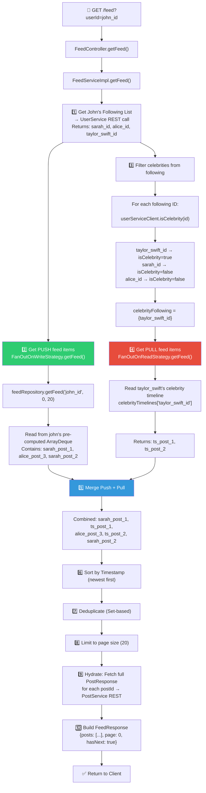

### Code Walkthrough: FeedServiceImpl

```java
// FeedServiceImpl.java:56-105
public FeedResponse getFeed(String userId, int page, int size) {
    
    // STEP 1: Get who this user follows
    Set<String> following = userServiceClient.getFollowingIds(userId);
    // REST call: GET http://localhost:8081/api/v1/users/john_id/following/ids
    // Returns: {"sarah_id", "alice_id", "taylor_swift_id"}

    // STEP 2: Read pre-computed push feed (normal users' posts)
    List<FeedItem> pushFeedItems = fanOutOnWriteStrategy.getFeed(userId, following, page, size);
    // Simply reads from FeedRepository's ArrayDeque for this userId
    // These were pre-loaded when sarah/alice posted (FanOutOnWrite)

    // STEP 3: Identify which followed users are celebrities
    Set<String> celebrityFollowing = following.stream()
        .filter(userServiceClient::isCelebrity)
        .collect(Collectors.toSet());
    // REST calls: GET /users/sarah_id/is-celebrity → false
    //             GET /users/alice_id/is-celebrity → false
    //             GET /users/taylor_swift_id/is-celebrity → true
    // celebrityFollowing = {"taylor_swift_id"}

    // STEP 4: Dynamically pull celebrity posts
    List<FeedItem> pullFeedItems = Collections.emptyList();
    if (!celebrityFollowing.isEmpty()) {
        pullFeedItems = fanOutOnReadStrategy.getFeed(userId, celebrityFollowing, page, size);
        // Reads from celebrityTimelines map in memory
    }

    // STEP 5: Merge push + pull
    List<FeedItem> mergedFeed = new ArrayList<>();
    mergedFeed.addAll(pushFeedItems);
    mergedFeed.addAll(pullFeedItems);
    
    // STEP 6: Sort by timestamp (newest first)
    mergedFeed.sort(Comparator.comparing(FeedItem::getTimestamp).reversed());

    // STEP 7: Deduplicate
    Set<String> seen = new HashSet<>();
    List<FeedItem> deduplicated = mergedFeed.stream()
        .filter(item -> seen.add(item.getPostId()))  // returns false if already seen
        .limit(size)
        .collect(Collectors.toList());

    // STEP 8: Hydrate — fetch full post details
    List<PostResponse> postResponses = deduplicated.stream()
        .map(item -> postServiceClient.getPost(item.getPostId()))
        // REST call: GET http://localhost:8082/api/v1/posts/{postId}
        .filter(Objects::nonNull)       // skip if post service is down
        .collect(Collectors.toList());

    // STEP 9: Build response
    FeedResponse response = new FeedResponse();
    response.setUserId(userId);
    response.setPosts(postResponses);
    response.setPage(page);
    response.setSize(postResponses.size());
    response.setHasNext(deduplicated.size() >= size);
    return response;
}
```

### How FanOutOnWrite Works (Push Model)

When a **normal user** (< 100K followers) creates a post, their post is immediately pushed to every follower's feed cache:

```java
// FanOutOnWriteStrategy.java:41-61
public void distributePost(PostCreatedEvent event, Set<String> followerIds) {
    FeedItem feedItem = new FeedItem(
        event.getPostId(),
        event.getUserId(),
        event.getTimestamp(),
        1.0  // default engagement score
    );

    // Push to EVERY follower's feed cache
    for (String followerId : followerIds) {
        feedRepository.pushToFeed(followerId, feedItem);
        // feedCache["john_id"].addFirst(feedItem) → ArrayDeque LIFO
    }

    // Also push to the author's own feed
    feedRepository.pushToFeed(event.getUserId(), feedItem);
}
```

### How FanOutOnRead Works (Pull Model)

When a **celebrity** (≥ 100K followers) creates a post, the post is stored only in their personal timeline:

```java
// FanOutOnReadStrategy.java:44-66
public void distributePost(PostCreatedEvent event, Set<String> followerIds) {
    // Instead of pushing to 10M followers...
    FeedItem item = new FeedItem(event.getPostId(), event.getUserId(), ...);

    // Just store in celebrity's timeline
    celebrityTimelines
        .computeIfAbsent(event.getUserId(), k -> new ArrayList<>())
        .add(0, item);  // newest first

    // Trim to keep only 100 most recent posts
    while (timeline.size() > 100) {
        timeline.remove(timeline.size() - 1);
    }
}
```

Then at **read time**, the Feed Service dynamically merges all celebrity timelines:
```java
// FanOutOnReadStrategy.java:69-91
public List<FeedItem> getFeed(String userId, Set<String> followedCelebrities, ...) {
    List<FeedItem> merged = new ArrayList<>();
    
    for (String celebrityId : followedCelebrities) {
        List<FeedItem> timeline = celebrityTimelines.get(celebrityId);
        merged.addAll(timeline);
    }

    merged.sort(Comparator.comparing(FeedItem::getTimestamp).reversed());
    return merged.subList(start, end);  // paginate
}
```

### FeedRepository Internal Structure

```
feedCache: ConcurrentHashMap<String, Deque<FeedItem>>

  "john_id" → ArrayDeque (max 1000 items, newest at front)
    ├── FeedItem{postId: "sarah_post_5",  authorId: "sarah_id",  ts: 2025-04-14T01:00}
    ├── FeedItem{postId: "alice_post_12", authorId: "alice_id",  ts: 2025-04-13T23:30}
    ├── FeedItem{postId: "sarah_post_4",  authorId: "sarah_id",  ts: 2025-04-13T22:15}
    └── ... (up to 1000 items)

Simulates Redis LPUSH/LRANGE:
  pushToFeed()  → deque.addFirst(item)    // LPUSH
  getFeed()     → deque.stream().skip(page*size).limit(size)  // LRANGE
```

---

## 7. ❤️ Flow 5: Liking a Post

### HTTP Request
```http
POST /api/v1/posts/{postId}/likes?userId=john_id
```

### Internal Flow

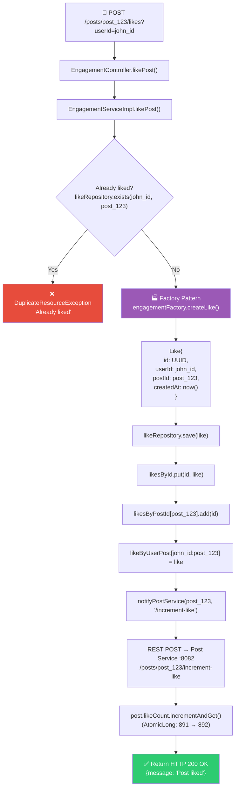

### Key Design: Idempotent Likes

```
Composite key: "userId:postId" → used as deduplication key
  likeByUserPost["john_id:post_123"] = Like{...}

Why? A user can only like a post ONCE.
  - First like:  save succeeds
  - Second like: exists() returns true → DuplicateResourceException
  - Unlike:      delete entry → user can like again
```

### Unlike Flow
```
1. Check likeRepository.exists(userId, postId) → must be true
2. likeRepository.delete(userId, postId) → removes from all 3 maps
3. POST /posts/{postId}/decrement-like → post.likeCount.decrementAndGet()
4. Idempotent: if not liked, simply returns (no error)
```

---

## 8. 💬 Flow 6: Commenting on a Post

> This flow showcases both **Factory** and **Decorator** patterns.

### HTTP Request
```http
POST /api/v1/posts/{postId}/comments
Content-Type: application/json

{
  "userId": "john_id",
  "postId": "post_123",
  "content": "This is absolutely amazing! Check out http://spam.com spam spam spam",
  "parentCommentId": null
}
```

### Flow with Content Filtering

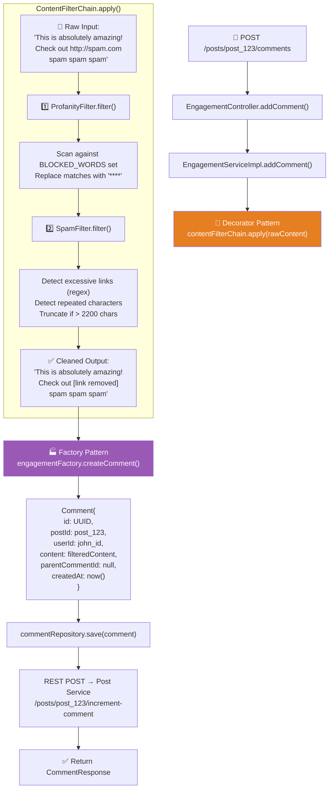

### Threaded Comments

Comments support **threading** via `parentCommentId`:

```
Comment A: "Amazing photo!"                     parentCommentId = null   (top-level)
  └── Comment B: "Thank you! 🙏"               parentCommentId = A.id   (reply)
       └── Comment C: "You're welcome!"         parentCommentId = B.id   (nested reply)
Comment D: "Where is this?"                     parentCommentId = null   (top-level)
```

---

## 9. 🔄 Flow 7: Sharing a Post

### HTTP Request
```http
POST /api/v1/posts/{postId}/shares?userId=john_id&sharedToUserId=alice_id
```

### Internal Flow

```
1. EngagementController.sharePost(postId, userId, sharedToUserId)
2. EngagementServiceImpl.sharePost()
3. EngagementFactory.createShare(userId, postId, sharedToUserId) → Factory pattern
   → Share{id: UUID, userId: john_id, postId: post_123, sharedToUserId: alice_id}
4. shareRepository.save(share)
5. notifyPostService(postId, "/increment-share")
   → REST POST → Post Service → post.shareCount.incrementAndGet()
6. Return 200 OK
```

---

## 10. 🔍 Flow 8: Searching (Users, Hashtags, Posts)

### Three Search Types

```mermaid
flowchart TB
    subgraph USER_SEARCH["User Search: GET /search/users?q=joh"]
        direction TB
        US1["TrieIndex.searchByPrefix('joh', 10)"]
        US2["Traverse: root → j → o → h"]
        US3["Collect all entries below 'h' node"]
        US4["Return: john_doe, john_smith, johnny_b"]
    end

    subgraph HASHTAG_SEARCH["Hashtag Search: GET /search/hashtags?q=trav"]
        direction TB
        HS1["TrieIndex.searchByPrefix('trav', 10)"]
        HS2["Traverse: root → t → r → a → v"]
        HS3["Collect: travel (50K), travelphotography (12K)"]
    end

    subgraph POST_SEARCH["Post Search: GET /search/posts?q=golden hour"]
        direction TB
        PS1["InvertedIndex.search('golden hour')"]
        PS2["Tokenize: ['golden', 'hour']"]
        PS3["index['golden'] → {post_1, post_5, post_9}"]
        PS4["index['hour'] → {post_1, post_3, post_9}"]
        PS5["AND intersection → {post_1, post_9}"]
    end

    style USER_SEARCH fill:#3498db,color:#fff
    style HASHTAG_SEARCH fill:#9b59b6,color:#fff
    style POST_SEARCH fill:#e74c3c,color:#fff
```

### How Trie Index Works Internally

```java
// TrieIndex.java — Insert
public void insert(String term, String id, double score) {
    TrieNode current = root;
    for (char c : term.toLowerCase().toCharArray()) {
        current = current.children.computeIfAbsent(c, k -> new TrieNode());
    }
    current.isEnd = true;
    current.entries.add(new IndexEntry(id, term, score));
}

// TrieIndex.java — Search by prefix
public List<IndexEntry> searchByPrefix(String prefix, int limit) {
    TrieNode current = root;
    for (char c : prefix.toLowerCase().toCharArray()) {
        current = current.children.get(c);
        if (current == null) return Collections.emptyList();  // no match
    }
    // DFS from this node to collect all entries
    List<IndexEntry> results = new ArrayList<>();
    collectEntries(current, results);
    return results.stream().limit(limit).toList();
}
```

### How Inverted Index Works Internally

```java
// InvertedIndex.java
public void indexDocument(String postId, String content) {
    Set<String> tokens = tokenize(content);
    // "Golden hour in Santorini" → {"golden", "hour", "in", "santorini"}
    
    for (String token : tokens) {
        index.computeIfAbsent(token, k -> ConcurrentHashMap.newKeySet()).add(postId);
        // index["golden"] = {post_123}
        // index["hour"] = {post_123}
    }
    reverseIndex.put(postId, tokens);  // for removal
}

public Set<String> search(String query) {
    Set<String> tokens = tokenize(query);
    // query = "golden hour" → tokens = {"golden", "hour"}
    
    // AND semantics — post must contain ALL query words
    return tokens.stream()
        .map(token -> index.getOrDefault(token, Collections.emptySet()))
        .reduce((a, b) -> {
            Set<String> intersection = new HashSet<>(a);
            intersection.retainAll(b);  // AND
            return intersection;
        })
        .orElse(Collections.emptySet());
}
```

---

## 11. 🔔 Flow 9: Notifications

### How Notifications Are Generated

Notifications are **event-driven** — they don't come from direct user actions on the Notification Service. Instead, other services push events:

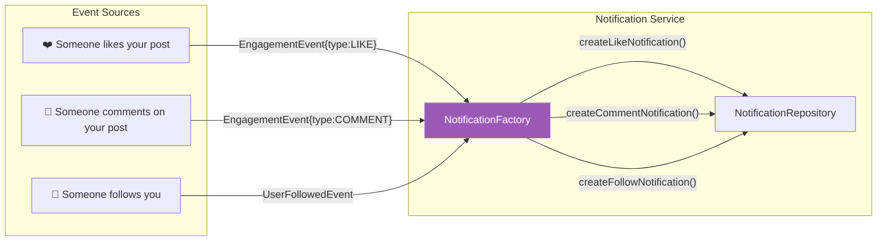

### NotificationFactory — Message Templates

```java
// NotificationFactory.java
public Notification createLikeNotification(String userId, String actorId, String postId) {
    return new Notification(
        UUID.randomUUID().toString(),
        userId,         // recipient (post owner)
        actorId,        // who liked
        NotificationType.LIKE,
        postId,         // reference
        actorId + " liked your post",    // human-readable message
        false,          // unread
        Instant.now()
    );
}

public Notification createCommentNotification(String userId, String actorId, String postId, String preview) {
    return new Notification(
        ..., NotificationType.COMMENT, ...,
        actorId + " commented: " + preview.substring(0, Math.min(50, preview.length())) + "...",
        ...
    );
}

public Notification createFollowNotification(String userId, String actorId) {
    return new Notification(
        ..., NotificationType.FOLLOW, actorId,
        actorId + " started following you",
        ...
    );
}
```

### Reading Notifications

```http
GET /api/v1/notifications?userId=sarah_id&page=0&size=20

Response:
[
  {"id": "n1", "type": "LIKE",    "message": "john_doe liked your post",        "read": false},
  {"id": "n2", "type": "COMMENT", "message": "alice commented: Amazing ph...",   "read": false},
  {"id": "n3", "type": "FOLLOW",  "message": "bob started following you",        "read": true}
]
```

### Mark as Read
```http
PUT /api/v1/notifications/n1/read
→ notification.setRead(true)
```

### Unread Count
```http
GET /api/v1/notifications/unread-count?userId=sarah_id
→ {"unreadCount": 2}
```

---

## 12. 📤 Flow 10: Media Upload (Pre-signed URL)

### The Two-Step Upload

Instagram doesn't upload media through the Post Service. Instead, it uses **pre-signed URLs** for direct client-to-storage upload:

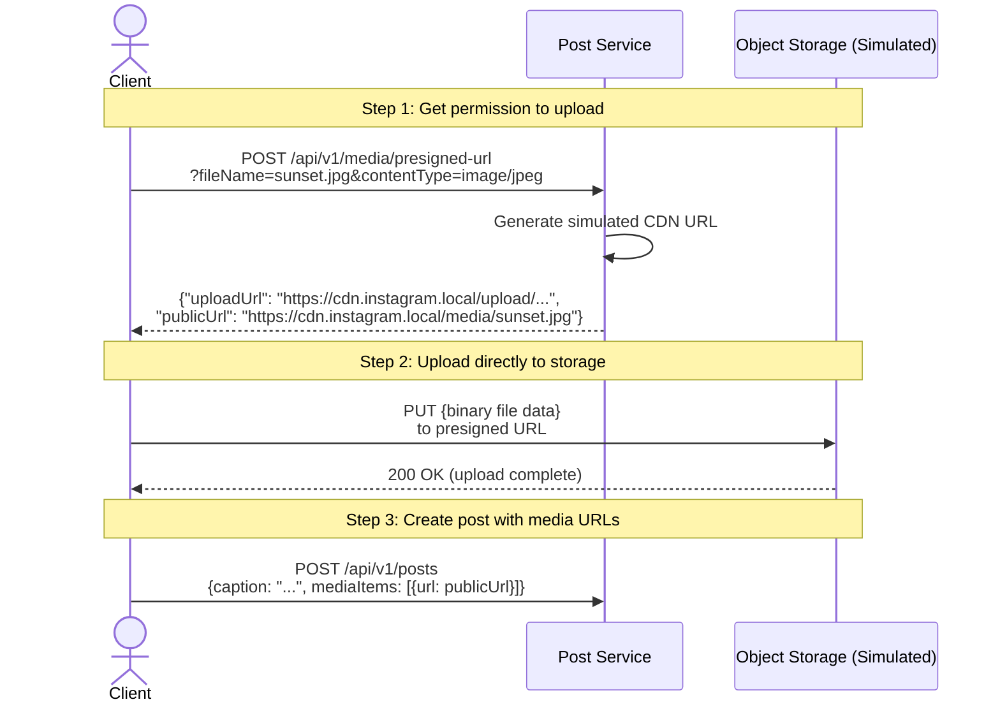

### Why Pre-signed URLs?

```
Without pre-signed URLs:            With pre-signed URLs:
Client → Post Service → S3          Client → S3 (direct)
                                     Client → Post Service (metadata only)

Problem:                             Solution:
- Post Service becomes bottleneck    - Post Service only handles metadata
- Binary data flows through API      - Media uploaded directly to storage
- High memory usage on service       - Infinitely scalable with CDN
```

---

## 13. 🔗 How Data Flows Between Services

### Complete Dependency Graph

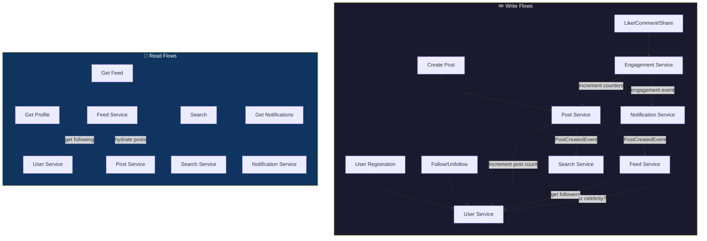

### Data Ownership

Each service is the **single source of truth** for its domain:

| Data | Owner | Other Services Access Via |
|------|-------|--------------------------|
| User profiles, follow graph | **User Service** | REST GET |
| Posts, media metadata, hashtags | **Post Service** | REST GET |
| Feed cache (per-user timeline) | **Feed Service** | Internal only |
| Likes, comments, shares | **Engagement Service** | REST (counts sent to Post Service) |
| Search indexes (Trie, Inverted) | **Search Service** | REST GET |
| Notifications | **Notification Service** | REST GET |

**No service directly reads another service's database.** All cross-service data access happens via REST APIs.

---

## 14. 🔒 Thread Safety & Concurrency Model

### How Thread Safety Is Achieved

Every service handles concurrent requests using Spring Boot's thread pool (200 threads default). Here's how data integrity is maintained:

#### Atomic Counters (Lock-Free)
```java
// User.java, Post.java
private final AtomicLong followerCount = new AtomicLong(0);

public void incrementFollowerCount() {
    followerCount.incrementAndGet();  // CAS loop — no locks needed
}
// Thread A: 999 → 1000 ✅
// Thread B: 1000 → 1001 ✅  (never loses an increment)
```

#### Concurrent Collections
```java
// All repositories use ConcurrentHashMap
private final Map<String, User> usersById = new ConcurrentHashMap<>();

// FollowRepository uses ConcurrentHashMap with Set values
private final Map<String, Set<String>> followersByUserId = new ConcurrentHashMap<>();

// FanOutOnReadStrategy uses synchronized list for celebrity timelines
celebrityTimelines.computeIfAbsent(userId, k -> Collections.synchronizedList(new ArrayList<>()));
```

#### Feed Repository Thread Safety
```java
// FeedRepository.java — ArrayDeque is NOT thread-safe, so we synchronize
public void pushToFeed(String userId, FeedItem item) {
    feedCache.computeIfAbsent(userId, k -> new ArrayDeque<>());
    Deque<FeedItem> feed = feedCache.get(userId);
    synchronized (feed) {
        feed.addFirst(item);
        while (feed.size() > MAX_FEED_SIZE) {
            feed.removeLast();  // evict oldest
        }
    }
}
```

---

## 15. ⚠️ Error Handling Across Services

### Exception Hierarchy

```
RuntimeException
├── ResourceNotFoundException      → HTTP 404
├── DuplicateResourceException     → HTTP 409
├── UnauthorizedException          → HTTP 403
└── IllegalArgumentException       → HTTP 400
```

### Per-Service Exception Handlers

Each service has a `@RestControllerAdvice` that converts exceptions to HTTP responses:

```java
// UserExceptionHandler.java
@ExceptionHandler(ResourceNotFoundException.class)
public ResponseEntity<Map<String, String>> handleNotFound(ResourceNotFoundException ex) {
    return ResponseEntity.status(HttpStatus.NOT_FOUND)
        .body(Map.of("error", ex.getMessage()));
    // {"error": "User not found: abc123"}
}

@ExceptionHandler(DuplicateResourceException.class)
public ResponseEntity<Map<String, String>> handleDuplicate(DuplicateResourceException ex) {
    return ResponseEntity.status(HttpStatus.CONFLICT)
        .body(Map.of("error", ex.getMessage()));
    // {"error": "User already exists: john_doe"}
}
```

### Resilient Cross-Service Calls

All REST calls to other services are wrapped in try-catch for **fault tolerance**:

```java
// PostServiceImpl.java:99-106
try {
    restClient.post()
        .uri(userServiceUrl + "/api/v1/users/" + userId + "/increment-post-count")
        .retrieve()
        .toBodilessEntity();
} catch (Exception e) {
    log.warn("User Service unavailable: {}", e.getMessage());
    // Post creation still succeeds even if User Service is down
    // Counter will be inconsistent, but the post is saved
}
```

---

## 16. 🎬 Complete End-to-End Walkthrough

> This is the full story of a user journey from registration to seeing a populated feed.

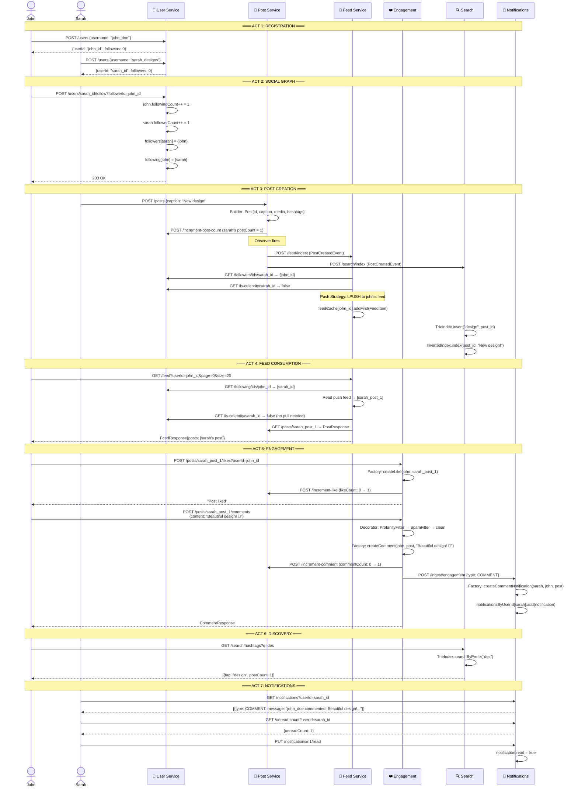

### State After Complete Walkthrough

```
=== User Service State ===
usersById: {
  "john_id":  User{username: "john_doe",  followers: 0, following: 1, posts: 0}
  "sarah_id": User{username: "sarah_designs", followers: 1, following: 0, posts: 1}
}
following["john_id"] = {"sarah_id"}
followers["sarah_id"] = {"john_id"}

=== Post Service State ===
postsById: {
  "post_1": Post{userId: "sarah_id", caption: "New design! #design",
                 likes: 1, comments: 1, shares: 0, status: PUBLISHED}
}
hashtagsByTag: {
  "design": Hashtag{tag: "design", postCount: 1}
}

=== Feed Service State ===
feedCache: {
  "john_id":  Deque[FeedItem{postId: "post_1", authorId: "sarah_id"}]
  "sarah_id": Deque[FeedItem{postId: "post_1", authorId: "sarah_id"}]
}

=== Engagement Service State ===
likesById:      {"like_1": Like{userId: "john_id", postId: "post_1"}}
commentsById:   {"comment_1": Comment{userId: "john_id", content: "Beautiful design! 🎨"}}
likeByUserPost: {"john_id:post_1": like_1}

=== Search Service State ===
TrieIndex (hashtag): root → d → e → s → i → g → n → [design: post_1]
InvertedIndex:       "new" → {post_1}, "design" → {post_1}

=== Notification Service State ===
notificationsByUserId: {
  "sarah_id": [
    Notification{type: COMMENT, message: "john_id commented: Beautiful design!...", read: true}
  ]
}
```

---

## 📊 Summary: Design Pattern Application

| Flow | Patterns Used | Why |
|------|--------------|-----|
| **Post Creation** | Builder, Observer | Flexible construction + decoupled event fan-out |
| **Feed Generation** | Strategy | Push for normal, pull for celebrities |
| **Like/Comment/Share** | Factory | Centralizes engagement object creation |
| **Comment Filtering** | Decorator | Chainable, extensible content filters |
| **Search Indexing** | Singleton | Central coordinator for Trie + InvertedIndex |
| **API Routing** | Facade | Single entry point for clients |
| **Rate Limiting** | Chain of Responsibility | Filter pipeline in gateway |

---

## 🎯 Key Takeaways

1. **No service accesses another service's data directly** — all communication via REST APIs
2. **Every write triggers a chain of events** — one POST /posts call touches 4 services
3. **Feed is the hardest problem** — hybrid push/pull solves the celebrity vs normal user dilemma
4. **Atomic operations prevent race conditions** — AtomicLong counters, ConcurrentHashMap
5. **Observer pattern decouples producers from consumers** — PostService doesn't know about FeedService
6. **Factory pattern centralizes object creation** — UUID generation, timestamps, defaults all in one place
7. **Decorator pattern makes filtering extensible** — add new filters without modifying existing ones
8. **Builder pattern handles complex construction** — Posts with 10+ optional fields
